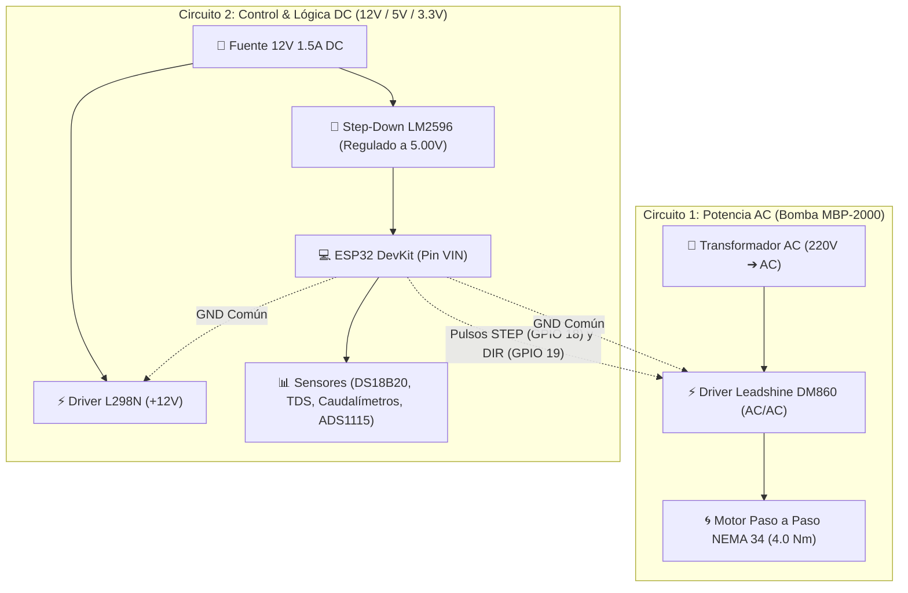

# 📦 HITO 1: Materiales, Inventario Consolidado y Armado Base de la Planta

Bienvenido al **Hito 1** del proyecto de tesis. Este hito tiene como objetivo principal organizar todos los materiales recibidos, verificar su estado físico, entender su rol en el proceso de tratamiento de agua y establecer la arquitectura de alimentación eléctrica libre de ruidos.

---

## 📋 Documentos de este Hito:

* 📄 **[Inventario_Consolidado.md](./Inventario_Consolidado.md)**: Listado completo de los componentes en mano, componentes en camino y lo que resta comprar con sus especificaciones exactas.
* 📄 **[Guia_Alimentacion_y_Masa_Comun.md](./Guia_Alimentacion_y_Masa_Comun.md)**: Esquema detallado de los dos circuitos eléctricos (Transformador AC para el DM860 y Fuente 12V DC para el L298N y ESP32) con la técnica de masa común por conectores rápidos.
* 📄 **[Guia_Ferreteria_e_Hidraulica_Base.md](./Guia_Ferreteria_e_Hidraulica_Base.md)**: Especificaciones de mangueras, racores G1/4", espigas y fijaciones mecánicas para el banco de pruebas.

---

## ⚡ Esquema Conceptual de Alimentación de la Planta

---

## 🎯 Criterios de Éxito para Dar por Cumplido el Hito 1:
- [x] Inventario de compras y materiales 100% verificado.
- [x] Módulo LM2596 calibrado con multímetro exactamente a **`5.00 V DC`**.
- [x] Cableado de masa común (GND) preparado con los conectores rápidos a presión.
- [x] Transformador AC conectado exclusivamente al driver DM860.
