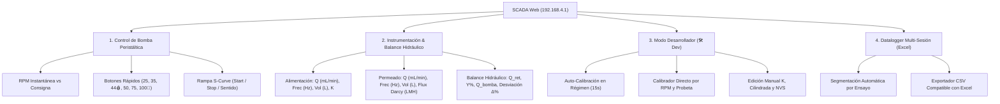

# GUÍA OPERATIVA DEL SCADA WEB Y PROTOCOLO DE CALIBRACIÓN
## Planta Piloto de Ultrafiltración FX-100 • Firmware v4 (Subhito 2.2)

---

> [!NOTE]
> **Acceso a la Interfaz Web:**
> * **Punto de Acceso Wi-Fi (Modo Local Planta):** Conectarse a la red `Bomba_Peristaltica_UF` (Contraseña: `plantapiloto2`).
> * **Dirección IP en Navegador:** `http://192.168.4.1/` o mediante mDNS `http://bomba.local/`.
> * **Sin Dependencia de Internet:** La red del ESP32 cuenta con un *Servidor DNS Captive Portal* integrado en el puerto 53 que responde a cualquier consulta del sistema operativo, garantizando que computadoras y celulares no descarten la red.

---

## 1. Arquitectura y Distribución del Panel SCADA

La interfaz del SCADA v4 está organizada en **4 módulos funcionales** compactos, diseñados específicamente para su uso desde una notebook de laboratorio o teléfonos móviles en el banco de ensayo:



---

## 2. Módulo 1: Control de la Bomba Peristáltica (MBP-2000)

Este panel gobierna el motor paso a paso NEMA 23 acoplado al cabezal peristáltico mediante el driver industrial DM542.

```
+--------------------------------------------------------------+
| PLANTA UF • MBP-2000                         [🛠️ Modo Dev]   |
| Rampa Fluida S-Curve • Despegue Suave & Parada Rápida         |
|                                                              |
|                     [ 50.0 ] RPM                             |
|          RPM INSTANTÁNEA (OBJETIVO: 50 RPM)                  |
|                   [ EN MARCHA ]                              |
|                                                              |
| Consigna de Operación:  50 RPM                               |
| [====================O=====================================] |
| [ 25 RPM ]  [ 35 RPM ]  [ 44 RPM 🩸]                         |
| [ 50 RPM ]  [ 75 RPM ]  [ 100 RPM 🧪]                        |
|                                                              |
| [ ▶ ARRANCAR ]   [ ⏹ PARAR ]                                 |
| [ 🔄 HORARIO (FILTRACIÓN) ]                                  |
+--------------------------------------------------------------+
```

### Elementos y Funciones:
1. **Pantalla Principal de RPM:**
   * Muestra la velocidad angular **instantánea real** en tiempo real (por ejemplo, subiendo de `0.0` a `50.0` durante la aceleración).
   * Indica en el subtítulo la **consigna objetivo**.
2. **Badge de Estado:**
   * `DETENIDA` (Gris): Pulsos de step inactivos, bobinas relajadas según configuración.
   * `EN MARCHA` (Verde): Generando pulsos por interrupción de hardware del ESP32.
   * `INVIRTIENDO` (Ámbar): Transición de frenado y cambio de sentido de giro para proteger el rotor y las mangueras.
3. **Selección de Velocidad (Consignas Predefinidas & Slider):**
   * **Slider Continuo:** Permite ajustar con precisión de 1 en 1 entre **15 RPM y 100 RPM**.
   * **Botonera de Acceso Rápido:**
     * `25 RPM`: Régimen bajo para purga inicial y verificación de estanqueidad.
     * `35 RPM`: Flujo intermedio bajo (~476 mL/min).
     * `44 RPM 🩸`: **Punto Crítico Clínico** (Caudal de alimentación de 600 mL/min, límite estándar en hemodiálisis y perfusión para evitar hemólisis).
     * `50 RPM`: **Punto Nominal de Calibración (Ensayo 2)** (~680 mL/min).
     * `75 RPM`: Flujo medio-alto (~1020 mL/min).
     * `100 RPM 🧪`: **Límite de Diseño Factorial (Ensayo 3)** (~1360 mL/min para ensayo de fatiga con agua pura).
4. **Botonera de Maniobra:**
   * **▶ ARRANCAR:** Dispara la aceleración suave siguiendo una curva Sigmoide (S-Curve). Evita el golpe de ariete sobre la membrana capilar de ultrafiltración y previene la pérdida de pasos por inercia del motor.
   * **⏹ PARAR:** Desacelera la bomba, detiene el tren de pulsos y **cierra automáticamente el ensayo en curso**, guardando sus métricas en el historial.
   * **🔄 SENTIDO (HORARIO / ANTIHORARIO):** Conmuta el sentido de giro.  
     * *Horario:* Modo Filtración habitual (la bomba impulsa líquido hacia el cartucho).  
     * *Antihorario:* Modo Retrolavado (Backwash) o vaciado de líneas.

---

## 3. Módulo 2: Instrumentación y Caudalímetros YF-S401

Los sensores están dispuestos en **cascada vertical** para facilitar la lectura visual clara de la línea de entrada vs. la línea de salida.

```
+--------------------------------------------------------------+
| 🌊 CAUDALÍMETROS YF-S401                 [Reset Volúmenes]   |
|                                                              |
| [ALIMENTACIÓN (GPIO 14)]                                     |
|    680.4 mL/min                             1.240 L          |
|    Frecuencia: 133.6 Hz          Factor K: 196.37 Hz/(L/min) |
|                                                              |
| [PERMEADO (GPIO 27)]                                         |
|    102.1 mL/min                             0.185 L          |
|    Frecuencia: 70.2 Hz           Flujo Darcy: 29.17 LMH      |
|                                                              |
| [ BALANCE HIDRÁULICO ]                                       |
|    Caudal Retentado (Qalim − Qperm):          578.3 mL/min   |
|    Tasa de Recuperación (Y% = Qperm/Qalim):   15.0 %         |
|    Caudal Teórico Bomba:                      680.0 mL/min   |
|    Desviación (Δ Bomba vs Alimentación):      +0.1 %         |
+--------------------------------------------------------------+
```

### Variables Medidas e Interpretación:
* **Caudal Instantáneo ($Q$ en mL/min):** Calculado mediante el factor K calibrado a partir de la frecuencia de pulsos leída por hardware en ventana temporal de 500 ms con filtro móvil.
* **Volumen Acumulado ($V$ en Litros):** Integración trapecial exacta de los pulsos del sensor. Ideal para comparar contra el volumen recogido en la probeta graduada.
* **Frecuencia ($f$ en Hz):** Frecuencia pura entregada por el sensor Hall del caudalímetro. Permite auditar si el sensor gira libremente o tiene rozamiento.
* **Flujo Volumétrico de Darcy ($J$ en $\text{LMH}$):**
  $$\text{Flux Darcy } J = \frac{Q_{perm}\;[\text{L/h}]}{A_{membrana}\;[\text{m}^2]} = \frac{Q_{perm}\;[\text{mL/min}] \times 0.06}{0.21\;\text{m}^2}$$
  Expresa el rendimiento real de permeación por unidad de área de la membrana capilar (área nominal de fibra hueca FX-100: $0.21\text{ m}^2$).
* **Botón `[Reset Volúmenes]`:** Pone a cero los acumuladores de litros de ambos sensores sin detener la bomba. **Debe presionarse justo en el instante en que se coloca la probeta vacía bajo la descarga.**

### Diagnóstico del Balance Hidráulico:
1. **Caudal Retentado ($Q_{ret} = Q_{alim} - Q_{perm}$):** Flujo de agua concentrada que retorna al tanque de alimentación o recirculación.
2. **Tasa de Recuperación ($Y\% = \frac{Q_{perm}}{Q_{alim}} \times 100$):** Porcentaje del agua alimentada que atraviesa los poros de la membrana.
3. **Desviación Hidráulica ($\Delta\%$):**
   $$\Delta\% = \frac{Q_{alim} - Q_{teorico\_bomba}}{Q_{teorico\_bomba}} \times 100$$
   * $\Delta \approx 0\%$: Bomba y sensor de alimentación calibrados en perfecta sintonía.
   * $\Delta < -5\%$: Posible ingreso de aire, manguera estrangulada, o deslizamiento del tubo de silicona en los rodillos.
   * $\Delta > +5\%$: Descalibración de factor K o contrapresión que distorsiona la cilindrada.

### Alertas Inteligentes del SCADA:
* 🔴 **`SIN SEÑAL` (Badge rojo junto al sensor):** Se enciende automáticamente si la bomba gira a más de 15 RPM pero el caudalímetro registra 0 pulsos por más de 1 segundo (alerta de cable desconectado, rotor trabado por sedimento o burbuja atrapada).
* ⚠️ **`ALERTA CRÍTICA: Cruce de sensores detectado`:** Aparece en banner rojo si $Q_{perm} > Q_{alim}$. Físicamente es imposible que salga más permeado del que ingresa; indica que se intercambiaron los cables de los sensores o las mangueras hidráulicas.
* ⚠️ **`ALERTA: Caudal Alimentación excede límite (> 1600 mL/min)`:** Protección preventiva contra sobrepresión o rotura de cabezales.

---

## 4. Módulo 3: Modo Desarrollador (🛠️ Modo Dev / Calibración en Caliente)

Se abre presionando el botón violeta **`🛠️ Modo Dev`** en la esquina superior derecha. Se cierra automáticamente al guardar con éxito.

```
+--------------------------------------------------------------+
| 🛠️ CALIBRACIÓN EN CALIENTE Y AUTO-TUNING         [✕ Cerrar]  |
|                                                              |
| [⚡ AUTO-CALIBRACIÓN EN RÉGIMEN PERMANENTE]                  |
|    🟢 Régimen Permanente Estable                             |
|    Calcula automáticamente los factores K durante 15s.       |
|    [=========================>            ] 65%              |
|    [ ▶ Iniciar Auto-Calibración (15s) ]  [ ✖ Cancelar ]      |
|                                                              |
| [🎯 CALIBRAR POR RPM & CAUDAL (PROBETA)]                     |
|    RPM Ensayo:     Q Alim (mL/min):     Q Perm (mL/min):     |
|    [   50.0  ]     [    680.0     ]     [    100.0     ]     |
|    [ 🚀 Calcular y Guardar Calibración en ESP32 ]            |
|                                                              |
| [ PARÁMETROS INTERNOS DEL ESP32 ]                            |
|    K Alimentación: [ 196.37 ]    K Permeado: [ 687.33 ]      |
|    Cilindrada:     [  13.60 ]    Micropasos: [  3200  ]      |
|                                                              |
| [ 💾 Guardar en Flash ESP32 ]   [ ⚡ Aplicar Temporal ]       |
| [ 🔄 Restablecer Valores de Fábrica ]                        |
+--------------------------------------------------------------+
```

Este módulo cuenta con **tres métodos de calibración**:

### Método A: Calibración Directa con Probeta (¡El Método Recomendado para Hoy!)
Es el procedimiento más exacto y riguroso cuando se trabaja en el laboratorio con cronómetro y probeta:
1. Poner la bomba a **50 RPM** y esperar a que el flujo sea estable.
2. Medir con probeta y cronómetro el caudal real de alimentación (ej. $680.0\text{ mL/min}$).
3. Si el permeado está conectado, medir también el caudal de permeado (ej. $100.0\text{ mL/min}$). Si el permeado está cerrado o recirculando, dejar el casillero en `0`.
4. Ingresar los valores en los campos:
   * **RPM Ensayo:** `50`
   * **Q Alim (mL/min):** `680`
   * **Q Perm (mL/min):** `100` (o `0` si no se ensaya)
5. Presionar **`🚀 Calcular y Guardar Calibración en ESP32`**.
6. **¿Qué hace el ESP32 en ese instante?**
   * Recalcula la cilindrada exacta de la manguera: $\text{ml\_rev} = \frac{Q_{alim}}{\text{RPM}} = \frac{680}{50} = 13.60\text{ mL/rev}$.
   * Lee la frecuencia actual del sensor $f_{alim}$ y recalcula: $K_{alim} = \frac{f_{alim} \times 1000}{Q_{alim}}$.
   * Recalcula $K_{perm}$ a partir de $f_{perm}$ (si se ingresó permeado).
   * **Guarda automáticamente los nuevos valores en la memoria Flash no volátil (`NVS`)**, de modo que permanecen guardados incluso si se apaga la planta.

### Método B: Auto-Calibración Inteligente en Régimen Permanente (15 segundos)
* Pensado para cuando la cilindrada de la bomba ya se conoce y se desea reajustar los caudalímetros de forma autónoma.
* Requiere que la bomba esté encendida.
* El firmware monitorea la bandera `en_regimen` (asegura que las RPM hayan llegado al valor final de la rampa S-Curve).
* Al presionar **`▶ Iniciar Auto-Calibración Automática (15s)`**, el microcontrolador muestrea la frecuencia durante 15 lecturas continuas, calcula el promedio y actualiza los factores K automáticamente.

### Método C: Ajuste Manual Fino
Permite tipear directamente los números:
* **Factor K Alimentación:** Pulsos por litro por segundo escalados [Hz/(L/min)].
* **Factor K Permeado:** Calibración específica del sensor de permeado.
* **Cilindrada Bomba (mL/rev):** Volumen desplazado por el cabezal peristáltico en 1 vuelta completa.
* **Micropasos (Pulsos/Rev):** Microstepping del driver DM542 (por defecto `3200` micropasos/vuelta).
* **Botones:**
  * `💾 Guardar en Flash ESP32`: Graba en NVS permanente y cierra el modo Dev.
  * `⚡ Aplicar Temporal`: Aplica en la memoria RAM para probar sin alterar los valores guardados en disco.
  * `🔄 Restablecer Valores de Fábrica`: Vuelve a los valores compilados por defecto en `config.h`.

---

## 5. Módulo 4: Datalogger Multi-Sesión & Descarga a Excel (.CSV)

El datalogger registra automáticamente todas las variables del proceso cada **1 segundo** en un buffer circular en la memoria RAM del ESP32.

```
+--------------------------------------------------------------+
| 📊 HISTORIAL DE ENSAYOS & EXCEL (.CSV)     [🗑️ Limpiar Todo] |
|                                                              |
| Ensayo actual en curso:  Ensayo #2  (03:45 min)              |
| Muestras registradas:    225 muestras guardadas              |
|                                                              |
| Seleccionar Ensayo para Descargar:                           |
| [ 📦 Todos los Ensayos (Histórico Completo)                ▼ ] |
|                                                              |
| [ 📥 Descargar Ensayo Seleccionado en Excel (.CSV) ]         |
|                                                              |
| Corridas Registradas al Apagar Bomba:      2 ensayos         |
| +----+----------+-----------+----------+----------+--------+ |
| | ID | Consigna | Duración  | Muestras | Vol Perm | Acción | |
| +----+----------+-----------+----------+----------+--------+ |
| | #2 | 50.0 RPM | 03:45 min | 225      | 0.380 L  | [📥CSV]| |
| | #1 | 25.0 RPM | 02:10 min | 130      | 0.150 L  | [📥CSV]| |
| +----+----------+-----------+----------+----------+--------+ |
+--------------------------------------------------------------+
```

### ¿Cómo Funciona la Segmentación Automática de Ensayos?
1. **Inicio de Ensayo:** Cada vez que se presiona **`▶ ARRANCAR`**, el ESP32 inicia un nuevo ensayo con número correlativo (`Ensayo #1`, `Ensayo #2`, etc.) y resetea el cronómetro del ensayo.
2. **Fin de Ensayo:** Al presionar **`⏹ PARAR`**, el microcontrolador archiva el ensayo finalizado con su duración total en segundos, cantidad de muestras y volumen acumulado, agregándolo a la tabla inferior.
3. **Descarga Selectiva:**
   * En el selector desplegable se puede elegir descargar **un solo ensayo en particular** (ej. solo el Ensayo #2 a 50 RPM) o bien **el histórico completo** con todas las corridas de la jornada.
   * También se puede descargar directamente un ensayo de la tabla presionando su botón verde individual `[📥 CSV]`.
4. **Compatibilidad con Microsoft Excel:**
   * El archivo exportado incluye la directiva `sep=;` en la primera línea.
   * Al hacer doble clic en Windows, **se abre directamente en Excel en columnas separadas**, sin necesidad de usar el asistente de importación de texto.
   * Contiene encabezados de ingeniería detallados:
     `Tiempo_s`, `RPM_Bomba`, `Q_Alimentacion_mLmin`, `Vol_Alimentacion_L`, `Q_PERMEADO_mLmin`, `Vol_PERMEADO_L`, `Q_Retentado_mLmin`, `Recuperacion_Y_Pct`, `Desviacion_Bomba_Alim_Pct`, `J_LMH`.
5. **Botón `🗑️ Limpiar Todo`:** Vacía la memoria del datalogger para iniciar una nueva tanda de ensayos limpios sin mezclar datos anteriores.

---

## 6. Procedimiento Rápido para los Ensayos de Calibración de Hoy

Para el trabajo conjunto con Owen y Antonella en el laboratorio:

### Paso 1: Verificación Inicial
1. Conectar la notebook al Wi-Fi `Bomba_Peristaltica_UF` (o dejarla con cable de red y Wi-Fi a la bomba).
2. Abrir el navegador en `http://192.168.4.1/`.
3. Verificar que los badges `SIN SEÑAL` estén apagados y la lectura marque `0.0`.

### Paso 2: Ensayo 2 (Punto Fijo 50 RPM)
1. Colocar las mangueras de descarga en probeta vacía.
2. En el SCADA, seleccionar el botón `50 RPM`.
3. Presionar `▶ ARRANCAR`. La bomba acelerará suavemente en 2.5 segundos.
4. Presionar `[Reset Volúmenes]` apenas el flujo caiga dentro de la probeta para sincronizar volumen y tiempo.
5. Dejar correr durante 2 minutos cronometrados.
6. Presionar `⏹ PARAR`.
7. Tomar la lectura de la probeta en mL y calcular el caudal real ($Q = \text{mL} / \text{min}$).
8. Si se requiere ajustar factores, abrir `🛠️ Modo Dev`, colocar las RPM y el caudal de probeta medido, y presionar `🚀 Calcular y Guardar Calibración`.
9. Presionar `[📥 CSV]` en la tabla del ensayo para guardar el registro digital en la notebook.

### Paso 3: Ensayo 3 (Barrido Multifactorial 25 a 100 RPM)
1. Repetir el procedimiento para 25, 35, 44, 75 y 100 RPM.
2. Al finalizar todas las corridas, seleccionar en el desplegable `📦 Todos los Ensayos (Histórico Completo)` y presionar `📥 Descargar Ensayo Seleccionado en Excel (.CSV)`.
3. Copiar las columnas a la planilla `PLANILLA_CALIBRACION_ENSAYOS_2_Y_3.xlsx` para graficar las curvas $Q \text{ vs. RPM}$ y obtener el $R^2$ de regresión lineal.
