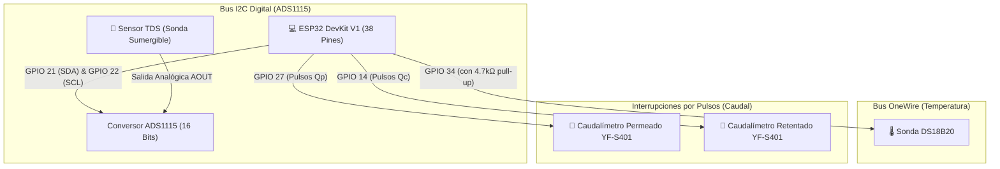

# 📊 HITO 2: Instrumentación y Sensores Disponibles (Caudal, TDS, Temperatura y ADC)

Este hito tiene como objetivo instrumentar la planta piloto con los sensores físicos ya disponibles en el laboratorio, aprender a leer señales digitales y analógicas en el ESP32, comprender el funcionamiento del conversor ADC ADS1115 de 16 bits y visualizar toda la telemetría en la computadora.

---

## 🎯 Entregable Maestro del Hito 2
* **Módulo de telemetría de instrumentación operando al 100%**: Adquisición periódica y continua (1 Hz) de Caudal de Permeado ($Q_p$), Caudal de Retentado ($Q_c$), Temperatura del agua ($^\circ\text{C}$) y Sólidos Totales Disueltos ($\text{ppm}$) transmitidos por puerto serie o bus I2C sin falsas lecturas ni ruido eléctrico.

---

## 📋 Lista de Verificación Maestra (Checklist del Hito 2)
- [ ] Conexión del bus I2C (`GPIO 21` SDA, `GPIO 22` SCL) al módulo ADS1115 verificada con escáner I2C.
- [ ] Sonda sumergible DS18B20 conectada a `GPIO 34` con su resistencia de pull-up de $4.7\text{ k}\Omega$ a 3.3V.
- [ ] Caudalímetro de Permeado montado en tubería y conectado al pin de interrupción `GPIO 27`.
- [ ] Caudalímetro de Retentado montado en tubería y conectado al pin de interrupción `GPIO 14`.
- [ ] Sonda analógica TDS cableada al canal analógico A0 del ADS1115 y sumergida en la celda de flujo.
- [ ] Firmware `firmware_sensores_test.ino` subido al ESP32 transmitiendo telemetría en tiempo real a 115200 baudios.
- [ ] Calibración térmica validada: el factor de viscosidad Darcy $TCF = \exp(0.0239 \times (20 - T))$ responde dinámicamente a la temperatura.

---

## 🔬 1. Sensores Disponibles y Principio de Funcionamiento

```
┌──────────────────────────────┬───────────────────────────────┬───────────────────────────────┬────────────────────────┐
│ Sensor / Módulo              │ Tipo de Señal                 │ Rango de Medición             │ Pin ESP32 Asignado     │
├──────────────────────────────┼───────────────────────────────┼───────────────────────────────┼────────────────────────┤
│ Caudalímetro Permeado (YF)   │ Digital (Pulsos Efecto Hall)  │ 0.3 a 6.0 L/min               │ GPIO 27 (Interrupción) │
│ Caudalímetro Retentado (YF)  │ Digital (Pulsos Efecto Hall)  │ 0.3 a 6.0 L/min               │ GPIO 14 (Interrupción) │
│ Sensor Temperatura DS18B20   │ Digital (Protocolo OneWire)   │ -55 °C a +125 °C (±0.5 °C)    │ GPIO 34 (Datos)        │
│ Sensor Calidad de Agua (TDS) │ Analógica (0 a 2.3V)          │ 0 a 1000 ppm (mg/L)           │ ADS1115 Canal A0       │
│ Conversor ADC ADS1115        │ Bus Digital I2C (16 Bits)     │ 4 Canales Analógicos (A0-A3)  │ GPIO 21 (SDA) / 22 SCL │
└──────────────────────────────┴───────────────────────────────┴───────────────────────────────┴────────────────────────┘
```

---

## ⚡ 2. Esquema Eléctrico de Conexionado



---

## 📂 Estructura y Navegación de Subcarpetas de este Hito:

* 📁 **[`01_Guias_Montaje_y_Calibracion/`](./01_Guias_Montaje_y_Calibracion/)**:
  * 🚰 **[`Guia_Montaje_Hidraulico_Sensores.md`](./01_Guias_Montaje_y_Calibracion/Guia_Montaje_Hidraulico_Sensores.md)**: Instalación física de caudalímetros y sondas en tubería con entregable y checklist.
  * 📐 **[`Guia_Calibracion_ADC_ADS1115_y_Sensores.md`](./01_Guias_Montaje_y_Calibracion/Guia_Calibracion_ADC_ADS1115_y_Sensores.md)**: Fórmulas de conversión matemática, resolución de 16 bits y compensación térmica con entregable y checklist.
* 📁 **[`02_Firmware_Test_Sensores/`](./02_Firmware_Test_Sensores/)**:
  * 💻 **[`firmware_sensores_test/firmware_sensores_test.ino`](./02_Firmware_Test_Sensores/firmware_sensores_test/firmware_sensores_test.ino)**: Sketch oficial de adquisición de datos en tiempo real y transmisión serie en formato CSV.
