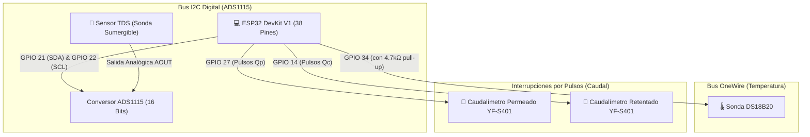

# 📊 HITO 3: Instrumentación y Sensores Disponibles (Caudal, TDS, Temperatura y ADC)

Este hito tiene como objetivo instrumentar la planta piloto con los sensores físicos ya disponibles en el laboratorio, aprender a leer señales digitales y analógicas en el ESP32, comprender el funcionamiento del conversor ADC ADS1115 de 16 bits y visualizar toda la telemetría en la computadora.

---

## 🔬 1. Sensores Disponibles y Principio de Funcionamiento

```
┌──────────────────────────────┬───────────────────────────────┬───────────────────────────────┬────────────────────────┐
│ Sensor / Módulo              │ Tipo de Señal                 │ Rango de Medición             │ Pin ESP32 Asignado     │
├──────────────────────────────┼───────────────────────────────┼───────────────────────────────┼────────────────────────┤
│ Caudalímetro Permeado (YF)   │ Digital (Pulsos Efecto Hall)  │ 0.3 a 6.0 L/min               │ GPIO 27 (Interrupción) │
│ Caudalímetro Retentado (YF)  │ Digital (Pulsos Efecto Hall)  │ 0.3 a 6.0 L/min               │ GPIO 14 (Interrupción) │
│ Sensor Temperatura DS18B20   │ Digital (Protocolo OneWire)   │ -55 °C a +125 °C (±0.5 °C)    │ GPIO 34 (Datos)        │
│ Sensor Calidad de Agua (TDS) │ Analógica (0 a 2.3V)          │ 0 a 1000 ppm (mg/L)           │ ADS1115 Canal A0       │
│ Conversor ADC ADS1115        │ Bus Digital I2C (16 Bits)     │ 4 Canales Analógicos (A0-A3)  │ GPIO 21 (SDA) / 22 SCL │
└──────────────────────────────┴───────────────────────────────┴───────────────────────────────┴────────────────────────┘
```

---

## ⚡ 2. Esquema Eléctrico de Conexionado



---

## 📐 3. Fundamentos Matemáticos y Conversión de Señales

### A. Conversor ADC ADS1115 de 16 Bits
* A diferencia del convertidor interno del ESP32 (que tiene ruido y no linealidad), el **ADS1115** ofrece **16 bits de resolución ($65.536$ niveles)**.
* Con ganancia $\text{GAIN\_ONE}$ ($\pm 4.096\text{V}$), cada conteo digital (*LSB*) equivale a:
  $$\text{Resolución} = \frac{4.096\text{ V}}{32768\text{ cuentas}} = 0.125\text{ mV por cuenta}$$
* **Cálculo de Voltaje Real**:
  $$V_{\text{medido}} (\text{V}) = \text{Cuentas ADS} \times 0.000125\text{ V}$$

### B. Cálculo de Sólidos Totales Disueltos (TDS en ppm)
A partir del voltaje analógico medido en el canal A0 y compensado por la temperatura del agua $T$:
$$V_{25} = \frac{V_{\text{medido}}}{1.0 + 0.02 \times (T - 25.0)}$$
$$\text{TDS} (\text{ppm}) = (133.42 \times V_{25}^3 - 255.86 \times V_{25}^2 + 857.39 \times V_{25}) \times 0.5$$

### C. Medición de Caudal con YF-S401
* Cada vuelta de la turbinita interna con imán activa el sensor de efecto Hall.
* Factor de calibración para el modelo YF-S401: **$98\text{ pulsos por segundo} = 1.0\text{ L/min}$**.
$$Q (\text{L/min}) = \frac{\text{Pulsos en } 1\text{ segundo}}{98.0}$$

---

## 💻 4. Cómo Probar los Sensores en el Laboratorio

1. Abre el sketch [`firmware_sensores_test.ino`](./firmware_sensores_test/firmware_sensores_test.ino) en Arduino IDE.
2. Asegúrate de tener instaladas las librerías:
   * **`Adafruit ADS1X15`**
   * **`OneWire`** y **`DallasTemperature`**
3. Sube el código al ESP32 y abre el Monitor Serie a **115200 baudios**.
4. Verás la telemetría en tiempo real:
   ```text
   [TELEMETRIA] Temp: 21.4 °C | TDS: 142.5 ppm | Caudal Permeado: 0.38 L/min | Caudal Retentado: 0.12 L/min
   ```
