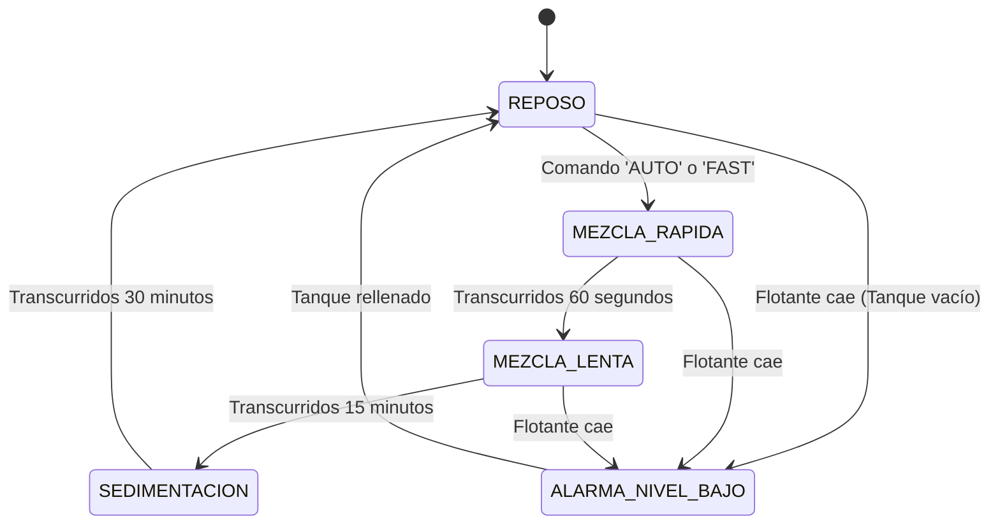

# ⚙️ GUÍA TÉCNICA: CONTROL DE AGITADOR CON DRIVER PUENTE H L298N & BOYA DE NIVEL
## Automatización del Sedimentador Cónico • Hito 3
**Tesistas**: Antonella Guitián & Owen Cañizares  
**Codirector**: Ing. Enzo (Investigación Doctoral en Membranas)

---

## 🎯 Entregable Concreto de esta Guía
* **Circuito de accionamiento del agitador y protección de nivel operativo**: Driver Puente H L298N cableado a $12\text{V DC}$, control de velocidad por modulación PWM en `GPIO 4`, inversión de giro en `GPIO 16/17`, y enclavamiento de seguridad con boya de nivel de acero inoxidable en `GPIO 32` gobernado por la Máquina de Estados Finitos (FSM) de `firmware_sedimentador.ino`.

---

## 📋 Lista de Verificación (Checklist de Avance)
- [ ] Jumper negro del pin `ENA` del driver L298N retirado para habilitar la modulación PWM externa.
- [ ] Cable flexible desde `GPIO 4` del ESP32 conectado al pin `ENA` del L298N.
- [ ] Cable desde `GPIO 16` conectado a `IN1` y cable desde `GPIO 17` conectado a `IN2`.
- [ ] Conexión de alimentación de $12\text{V DC}$ de la fuente a los bornes `+12V` y `GND` del L298N.
- [ ] Puente de masa común verificado: borne `GND` del L298N conectado a la regleta de masa del ESP32.
- [ ] Bornes `OUT1` y `OUT2` conectados a los terminales del motor DC reductor de la paleta.
- [ ] Boya de acero inoxidable conectada entre `GPIO 32` y `GND` con resistencia interna `INPUT_PULLUP`.
- [ ] Prueba de enclavamiento por flotante: Al bajar la boya con la mano, el motor debe detenerse instantáneamente.
- [ ] Firmware `firmware_sedimentador.ino` cargado al ESP32 y ciclo `AUTO` probado por monitor serie a 115200 baudios.

---

## 🔌 1. Esquema de Cableado Físico Pin a Pin

```
       ESP32 DevKit V1 (38 Pines)                     DRIVER PUENTE H L298N
     ┌────────────────────────────┐                 ┌────────────────────────┐
     │           GPIO 4 (D4)  ────┼────────────────►│ ENA (PWM Velocidad)    │ ◄── Quitar jumper negro
     │           GPIO 16 (D16) ───┼────────────────►│ IN1 (Sentido Giro A)   │
     │           GPIO 17 (D17) ───┼────────────────►│ IN2 (Sentido Giro B)   │
     │           GPIO 32 (D32) ───┼─┐               │ GND (Masa Común)       │ ◄── Masa Común ESP32
     │                     GND ───┼─┼──────────────►│ +12V (Alimentación) ◄──┼──── (+12V Fuente)
     └────────────────────────────┘ │               │                        │
                                    │               │ OUT1 ──────────────────┼──► Motor Paleta (Cable A)
                                    │               │ OUT2 ──────────────────┼──► Motor Paleta (Cable B)
                                    │               └────────────────────────┘
                                    │
                                    ▼
                    [ BOYA DE NIVEL EN ACERO INOXIDABLE ]
                    • Cable 1 ──► GPIO 32 (Entrada con INPUT_PULLUP)
                    • Cable 2 ──► GND Común (0V)
```

> [!IMPORTANT]
> **Retirar el jumper de ENA**: El módulo L298N viene de fábrica con un pequeño jumper plástico negro que puentea `ENA` con `5V` interno. Es **obligatorio retirarlo** para poder insertar el cable de señal PWM proveniente del `GPIO 4` del ESP32.

---

## ⚡ 2. Principio de Funcionamiento de la Boya de Nivel en Acero Inoxidable

La boya sumergible de acero inoxidable contiene en su vástago un sensor magnético hermético (*Reed Switch*) accionado por un imán anular dentro del flotador:
1. **Nivel Normal (Tanque Lleno / Con Agua)**:
   * El flotador flota hacia arriba.
   * El contacto interno se cierra conectando `GPIO 32` a `GND` (Lectura lógica `LOW = 0`).
   * El sistema autoriza la operación del motor agitador.
2. **Nivel Bajo / Alarma (Tanque Vacío)**:
   * El flotador cae por gravedad.
   * El contacto se abre y la resistencia interna de *pull-up* del ESP32 eleva el pin a $3.3\text{V}$ (Lectura lógica `HIGH = 1`).
   * El firmware ejecuta un corte inmediato de seguridad por software:
     ```cpp
     if (digitalRead(PIN_BOYA_NIVEL) == HIGH) {
       fijarVelocidadAgitador(0); // Detención inmediata
       estadoActual = ALARMA_NIVEL_BAJO;
     }
     ```

---

## 🎛️ 3. Modulación PWM y Calibración de Velocidades

El ESP32 utiliza el módulo periférico LEDC para generar ondas cuadradas de alta frecuencia ($5\text{ kHz}$) con resolución de 8 bits ($0 \text{ a } 255$):

* **Detención Total ($0\text{ RPM}$)**:
  `ledcWrite(PIN_AGIT_ENA, 0);`
* **Mezcla Lenta de Floculación ($\approx 30\text{ RPM}$)**:
  `ledcWrite(PIN_AGIT_ENA, 80);` (Ciclo de trabajo $\approx 31\%$)
* **Mezcla Rápida de Coagulación ($\approx 150\text{ RPM}$)**:
  `ledcWrite(PIN_AGIT_ENA, 220);` (Ciclo de trabajo $\approx 86\%$)

---

## 🔄 4. Máquina de Estados Finitos (FSM) del Proceso

El archivo [`firmware_sedimentador.ino`](./firmware_sedimentador/firmware_sedimentador.ino) implementa una máquina de estados determinística no bloqueante mediante la función `millis()`:



---

## 💻 5. Comandos Disponibles en Monitor Serie (115200 Baudios)

Una vez conectado el ESP32 por USB y abierto el Monitor Serie de Arduino IDE, se pueden enviar los siguientes comandos:
* `AUTO` ➔ Ejecuta el ciclo industrial completo de coagulación, floculación y sedimentación.
* `FAST` ➔ Activa de forma manual la mezcla rápida a $150\text{ RPM}$.
* `SLOW` ➔ Activa de forma manual la mezcla lenta a $30\text{ RPM}$.
* `STOP` ➔ Apaga inmediatamente el motor del agitador.
* `STATUS` ➔ Imprime el estado actual del proceso, tiempo transcurrido en segundos y lectura de la boya de nivel.
