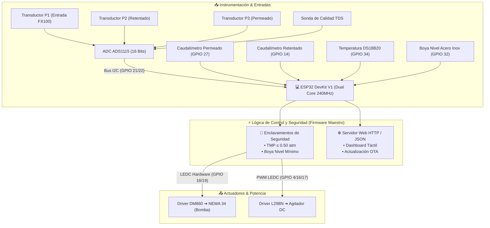

# 🛡️ GUÍA DE ARQUITECTURA DE CONTROL, ENCLAVAMIENTOS DE SEGURIDAD Y SCADA IOT
## Integración Total de la Planta Piloto de Ultrafiltración • Hito 4
**Tesistas**: Antonella Guitián & Owen Cañizares  
**Codirector**: Ing. Enzo (Investigación Doctoral en Membranas)

---

## 🎯 Entregable Concreto de esta Guía
* **Arquitectura de control integral y enclavamientos de seguridad operativos**: Sistema SCADA montado en el ESP32 con Servidor Web local, sincronización entre el reactor sedimentador y la bomba peristáltica MBP-2000, monitoreo en tiempo real de Presión Transmembrana ($\text{TMP}$) con corte automático de emergencia ante $\text{TMP} > 0.50\text{ atm}$ y bloqueo ante nivel bajo de tanque.

---

## 📋 Lista de Verificación (Checklist de Avance)
- [ ] Conexión física y direccionamiento I2C del ADS1115 verificado en `GPIO 21` (SDA) y `GPIO 22` (SCL).
- [ ] Transductores de presión hidráulica $G1/4"$ asignados: Entrada ($P_1$) en Canal A1, Retentado ($P_2$) en Canal A2, Permeado ($P_3$) en Canal A3.
- [ ] Ecuación de Presión Transmembrana verificada en código: $\text{TMP} = \frac{P_1 + P_2}{2} - P_3$.
- [ ] Enclavamiento de sobrepresión probado: si $\text{TMP} > 0.50\text{ atm}$, la bomba se detiene en $< 50\text{ ms}$ y la web muestra banner de alerta roja.
- [ ] Enclavamiento por boya verificado: si el reactor cónico está vacío (`GPIO 32 == HIGH`), el arranque de la bomba peristáltica se inhibe.
- [ ] Servidor Web activo: visualización de métricas en tiempo real ($Q_p$, $Q_c$, $J$, $\text{TMP}$, $\text{TDS}$, $\text{Temp}$) desde navegador en celular o PC.
- [ ] Control bidireccional probado desde la web: sliders de RPM, botones de mezcla rápida/lenta y parada de emergencia.
- [ ] Servicio ArduinoOTA habilitado para reprogramación inalámbrica sin desconectar el microcontrolador.

---

## 🏗️ 1. Arquitectura de Control Global del Sistema

La planta piloto de ultrafiltración integra tres subsistemas mecatrónicos acoplados:
1. **Subsistema de Potencia y Transporte**: Bomba peristáltica MBP-2000 accionada por el motor NEMA 34 ($4.5\text{ Nm}$) y driver Leadshine DM860 en Cátodo Común a $3.3\text{V}$.
2. **Subsistema de Pretratamiento Fisicoquímico**: Agitador de velocidad variable con driver L298N y boya de nivel en acero inoxidable.
3. **Subsistema de Supervisión e Instrumentación**: Caudalímetros de efecto Hall YF-S401, sonda de temperatura DS18B20 OneWire, sensor analógico de TDS y transductores piezoeléctricos de presión conectados al convertidor ADC ADS1115 de 16 bits.



---

## 🚨 2. Enclavamientos de Seguridad Mandatorios (Interlocks)

### 2.1. Enclavamiento Crítico de Presión Transmembrana ($\text{TMP} \le 0.50\text{ atm}$)
La membrana Fresenius FX100 contiene miles de fibras capilares huecas de Polisulfona/Helixone®. Sus especificaciones operativas toleran un diferencial de presión máximo de:

$$\text{TMP}_{\text{máx}} = 0.50\text{ atm} \approx 50.66\text{ kPa} \approx 0.51\text{ bar} \approx 7.35\text{ PSI}$$

> [!CAUTION]
> **Riesgo de Delaminación y Rotura de Fibras**: Si la $\text{TMP}$ excede los $0.50\text{ atm}$ debido a acumulación excesiva de torta de filtración o bloqueo de poros, las fibras capilares se rompen mecánicamente, destruyendo la esterilidad del permeado y arruinando el módulo de hemodiálisis de forma irreversible.

#### Algoritmo de Corte por Sobrepresión en `firmware_planta_completa.ino`:
```cpp
// Cálculo de Presión Transmembrana (TMP)
TMP_atm = ((P1_atm + P2_atm) / 2.0f) - P3_atm;

// Enclavamiento de Seguridad
if (TMP_atm > 0.50f) {
  alarmaTMP = true;
  bombaRpmActual = 0.0f;
  actualizarBombaPulsos(0.0f); // Apagado instantáneo de pulsos STEP
  bombaOn = false;
  Serial.println("[EMERGENCIA] TMP EXCEDIDA (> 0.50 atm). BOMBA BLOQUEADA!");
}
```

### 2.2. Enclavamiento contra Marcha en Seco (Protección de Manguera y Membrana)
* Si el flotador de la boya desciende por falta de agua en el sedimentador cónico, `digitalRead(PIN_BOYA_NIVEL)` lee estado `HIGH`.
* El microcontrolador detiene inmediatamente tanto el motor agitador como la bomba peristáltica MBP-2000.
* Esto evita la cavitación hidráulica, la introducción de burbujas de aire a la membrana FX100 (que reducen drásticamente el área de filtración) y el desgaste por rozamiento térmico de la manguera peristáltica.

---

## 📐 3. Ecuaciones de Calibración de los Transductores de Presión

Los transductores piezoeléctricos industriales operan con salida analógica lineal entre $0.5\text{V}$ ($0\text{ bar}$) y $4.5\text{V}$ ($1.2\text{ bar}$):

$$P (\text{bar}) = \left(\frac{V_{\text{medido}} - 0.5\text{ V}}{4.0\text{ V}}\right) \times 1.20\text{ bar}$$

Convirtiendo a atmósferas ($1\text{ bar} = 0.986923\text{ atm}$):

$$P (\text{atm}) = P (\text{bar}) \times 0.986923$$

```
┌─────────────────────────────────┬─────────────────────────────────┬────────────────────────────────┐
│ Transductor                     │ Ubicación Hidráulica            │ Canal ADC ADS1115              │
├─────────────────────────────────┼─────────────────────────────────┼────────────────────────────────┤
│ **Presión de Entrada (P1)**     │ Cabezal de entrada a membrana   │ Canal A1                       │
│ **Presión de Retentado (P2)**   │ Salida de concentrado (extremo) │ Canal A2                       │
│ **Presión de Permeado (P3)**    │ Salida lateral de agua filtrada │ Canal A3                       │
└─────────────────────────────────┴─────────────────────────────────┴────────────────────────────────┘
```

---

## 🌐 4. Dashboard Web SCADA Local y API REST

El ESP32 aloja en su memoria Flash una aplicación web responsive monomando (Single Page Application):
* **Acceso**: Escribir en cualquier navegador `http://bomba-uf.local` o la IP asignada (ej. `http://192.168.1.150` o `http://192.168.4.1`).
* **Endpoint de Telemetría (`/status`)**: Devuelve un payload JSON cada $400\text{ ms}$ con los valores instantáneos:
  ```json
  {
    "bomba_rpm": 30.0,
    "bomba_dir": 1,
    "agit_pwm": 80,
    "tmp": 0.12,
    "flux": 2.8,
    "qp": 0.105,
    "tds": 122.0,
    "nivel_bajo": 0,
    "alarma_tmp": 0
  }
  ```
* **Endpoint de Mandos (`/cmd?act=...`)**:
  * `SET_RPM&val=X`: Fija la velocidad deseada de la bomba con rampa suave.
  * `START_BOMBA` / `STOP_BOMBA`: Arranque y parada de la bomba peristáltica.
  * `TOGGLE_DIR`: Conmuta entre filtración (Horario) y retrolavado (Antihorario).
  * `AGIT_FAST` / `AGIT_SLOW` / `AGIT_STOP`: Control del sedimentador.
