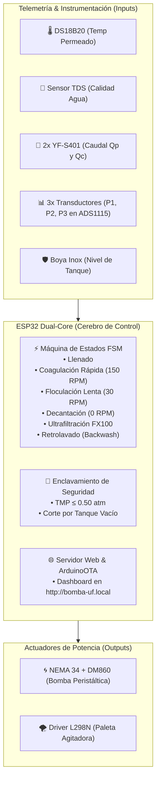

# 🌐 HITO 5: Integración Global, Automatización Total y Dashboard IoT

Este hito representa la convergencia de todos los subsistemas desarrollados en los hitos anteriores. El objetivo es sincronizar el Reactor de Coagulación, la Bomba Peristáltica MBP-2000 y el Módulo de Ultrafiltración FX100 bajo una Máquina de Estados Finitos (FSM) industrial supervisada por un Dashboard Web táctil con enclavamientos automáticos de seguridad.

---

## 🏗️ 1. Arquitectura Integral del Sistema SCADA

---

## 🛡️ 2. Enclavamientos de Seguridad de Proceso

1. **Protección de la Membrana FX100 contra Sobrepresión**:
   * Si $\text{TMP} = \frac{P_1 + P_2}{2} - P_3 > 0.50\text{ atm}$ ($50.66\text{ kPa}$), el ESP32 **detiene la bomba en $< 50\text{ ms}$** y activa alarma sonora/visual en la web para evitar delaminación o rotura de los capilares de Polisulfona.
2. **Protección contra Marcha en Seco**:
   * Si la boya de nivel (`GPIO 32`) detecta que el reactor no tiene agua, impide el arranque de la bomba para proteger la manguera peristáltica y no inyectar aire al filtro.

---

## 🛒 3. Compras Finales para Completar este Hito

Para poner en marcha este hito al 100%, solo resta adquirir:
* **3x Transductores de Presión Hidráulica ($0 \text{ a } 1.2\text{ bar}$ / $0 \text{ a } 17\text{ PSI}$, rosca G1/4", salida $0.5-4.5\text{V}$)**:
  * $P_1$: Entrada al cabezal FX100 (Canal A1 del ADS1115).
  * $P_2$: Salida de Retentado / Concentrado (Canal A2 del ADS1115).
  * $P_3$: Salida de Permeado Filtrado (Canal A3 del ADS1115).
