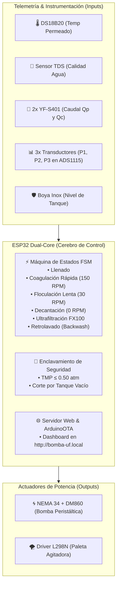

# 🌐 HITO 4: Integración Global, Automatización Total, Enclavamientos y SCADA IoT
## Supervisión en Tiempo Real, Enclavamientos de Seguridad (TMP ≤ 0.50 atm) y Control Multi-Lazo
**Tesistas**: Antonella Guitián & Owen Cañizares  
**Codirector**: Ing. Enzo (Investigación Doctoral en Membranas)

Este hito representa la convergencia de todos los subsistemas desarrollados en los hitos anteriores. El objetivo es sincronizar el Reactor de Coagulación, la Bomba Peristáltica MBP-2000 y el Módulo de Ultrafiltración FX100 bajo una Máquina de Estados Finitos (FSM) industrial supervisada por un Dashboard Web táctil con enclavamientos automáticos de seguridad.

---

## 🎯 Entregable Maestro del Hito 4
* **Sistema SCADA e Integración Total Operativo al 100%**: Plataforma de supervisión integral corriendo en el microcontrolador ESP32 DevKit V1 con servidor web embebido (accesible en `http://bomba-uf.local` o AP `Planta_UF_Master`), control táctil en tiempo real de actuadores (bomba peristáltica y agitador), adquisición síncrona de 6 variables físicas ($Q_p, Q_c, P_1, P_2, P_3, \text{TDS}, \text{Temp}$) y activación garantizada del enclavamiento de emergencia ante $\text{TMP} > 0.50\text{ atm}$ o nivel bajo de tanque.

---

## 📋 Lista de Verificación Maestra (Checklist del Hito 4)
- [ ] Conexión del bus I2C al ADS1115 y lectura analógica de transductores de presión en los canales A1, A2 y A3.
- [ ] Algoritmo de cálculo de Presión Transmembrana ($\text{TMP} = \frac{P_1 + P_2}{2} - P_3$) validado en memoria.
- [ ] Enclavamiento mandatorio comprobado: la bomba se detiene en $< 50\text{ ms}$ cuando la $\text{TMP}$ supera $0.50\text{ atm}$.
- [ ] Enclavamiento por boya verificado: el arranque de bomba y agitador se inhibe si el reactor está vacío.
- [ ] Dashboard Web SCADA responsivo cargado y accesible desde smartphone y PC sin necesidad de instalar aplicaciones.
- [ ] Servidor OTA verificado: capacidad de compilar y flashear nuevas versiones de firmware por Wi-Fi de forma remota.
- [ ] Integración de telemetría: visualización de flujo volumétrico Darcy ($J$, en $\text{LMH}$) y acumulación de litros en tiempo real.

---

## 🏗️ 1. Arquitectura Integral del Sistema SCADA

---

## 🛡️ 2. Enclavamientos de Seguridad de Proceso

1. **Protección de la Membrana FX100 contra Sobrepresión**:
   * Si $\text{TMP} = \frac{P_1 + P_2}{2} - P_3 > 0.50\text{ atm}$ ($50.66\text{ kPa}$), el ESP32 **detiene la bomba en $< 50\text{ ms}$** y activa alarma sonora/visual en la web para evitar delaminación o rotura de los capilares de Polisulfona.
2. **Protección contra Marcha en Seco**:
   * Si la boya de nivel (`GPIO 32`) detecta que el reactor no tiene agua, impide el arranque de la bomba para proteger la manguera peristáltica y no inyectar aire al filtro.

---

## 🛒 3. Compras Finales para Completar este Hito

Para poner en marcha este hito al 100%, solo resta adquirir:
* **3x Transductores de Presión Hidráulica ($0 \text{ a } 1.2\text{ bar}$ / $0 \text{ a } 17\text{ PSI}$, rosca G1/4", salida $0.5-4.5\text{V}$)**:
  * $P_1$: Entrada al cabezal FX100 (Canal A1 del ADS1115).
  * $P_2$: Salida de Retentado / Concentrado (Canal A2 del ADS1115).
  * $P_3$: Salida de Permeado Filtrado (Canal A3 del ADS1115).

---

## 📂 Estructura y Navegación de Subcarpetas de este Hito:

* 📁 **[`01_Arquitectura_y_Enclavamientos/`](./01_Arquitectura_y_Enclavamientos/)**:
  * 🛡️ **[`Guia_Enclavamientos_Seguridad_y_SCADA.md`](./01_Arquitectura_y_Enclavamientos/Guia_Enclavamientos_Seguridad_y_SCADA.md)**: Manual detallado de enclavamientos de seguridad, algoritmos de cálculo de TMP, mapeo de transductores en ADS1115, entregable y lista de verificación.
* 📁 **[`02_Firmware_SCADA_Master/`](./02_Firmware_SCADA_Master/)**:
  * 💻 **[`firmware_planta_completa/firmware_planta_completa.ino`](./02_Firmware_SCADA_Master/firmware_planta_completa/firmware_planta_completa.ino)**: Sketch maestro para ESP32 con servidor web industrial HTML5 embebido, control AJAX en tiempo real, máquina de estados y ArduinoOTA.
