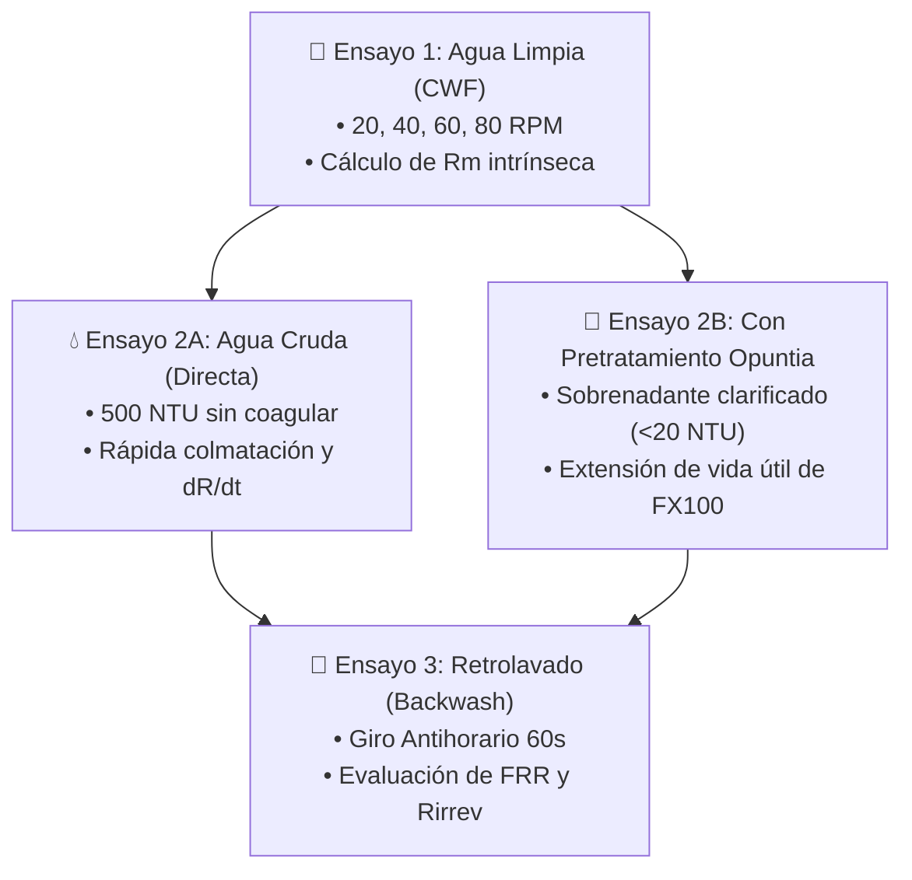

# 🧪 PROTOCOLO EXPERIMENTAL: ULTRAFILTRACIÓN FX100, MODELADO DARCY Y VIDA ÚTIL
## Ensayos de Fenómenos de Transporte, Ensuciamiento (Fouling) y Calidad de Agua • Hito 5
**Tesistas**: Antonella Guitián & Owen Cañizares  
**Codirector**: Ing. Enzo (Investigación Doctoral en Membranas)

---

## 🎯 Entregable Concreto de este Protocolo
* **Campaña experimental completa y modelo de transporte validado**: Determinación cuantitativa de la resistencia intrínseca ($R_m$), resistencia de torta ($R_{torta}$) y resistencia irreversible ($R_{irrev}$) del módulo Fresenius FX100, cálculo del Índice de Recuperación de Flujo ($FRR$) tras retrolavado, y verificación de potabilidad del agua permeada bajo los parámetros del Código Alimentario Argentino (CAA Art. 982).

---

## 📋 Lista de Verificación (Checklist de Avance)
- [ ] Membrana Fresenius FX100 montada en posición vertical con purga de aire realizada en los cabezales.
- [ ] Ensayo 1 (Clean Water Flux - CWF) completado con agua limpia a 20, 40, 60 y 80 RPM.
- [ ] Resistencia intrínseca de la membrana limpia ($R_m$) calculada por regresión lineal ($R^2 \ge 0.98$).
- [ ] Ensayo 2 (Filtración de agua cruda vs sobrenadante de *Opuntia*) completado y registrado en la planilla CSV.
- [ ] Ensayo 3 (Retrolavado con bomba en reversa) completado a $60\text{ s}$ de duración.
- [ ] Índice de Recuperación de Flujo ($FRR$) calculado y comparado contra el estado inicial.
- [ ] Muestras de agua cruda, sobrenadante y permeado analizadas en turbidez ($< 3\text{ NTU}$) y TDS ($< 1500\text{ ppm}$).
- [ ] Datos experimentales consolidados en `plantilla_datos_ensayo_tesis.csv` listos para el informe final de tesis.

---

## 🔬 1. Modelo Matemático de Fenómenos de Transporte (Ley de Darcy)

El transporte de solvente a través de los capilares microporosos de Polisulfona/Helixone® ($A_m = 2.2\text{ m}^2$) se describe mediante la **Ley de Darcy con modelo de resistencias en serie**:

$$J = \frac{Q_p}{A_m} = \frac{\text{TMP}}{\mu(T) \cdot R_{\text{total}}} \quad \left[\frac{\text{m}^3}{\text{m}^2 \cdot \text{s}} \equiv \frac{\text{m}}{\text{s}}\right]$$

Para su uso práctico en ingeniería de procesos, el flujo se expresa en **$\text{LMH}$** ($\text{L}/(\text{m}^2\cdot\text{h})$):

$$J \left[\frac{\text{L}}{\text{m}^2\cdot\text{h}}\right] = \frac{Q_p \left[\frac{\text{L}}{\text{min}}\right] \times 60}{2.2\text{ m}^2}$$

### 1.1. Factor de Corrección por Temperatura ($TCF$)
Dado que la viscosidad dinámica del agua disminuye fuertemente con el incremento de temperatura ($\approx 2.4\%/^\circ\text{C}$), todo flujo experimental $J$ medido a una temperatura $T$ ($^\circ\text{C}$) debe normalizarse a la temperatura estándar de referencia de $20^\circ\text{C}$ ($J_{20}$):

$$J_{20} = J \times TCF$$

$$TCF = \exp\left(0.0239 \times (20 - T)\right) = \frac{\mu(T)}{\mu_{20}}$$

Donde $\mu_{20} = 1.002 \times 10^{-3}\text{ Pa}\cdot\text{s} = 1.002\times 10^{-3}\text{ kg}/(\text{m}\cdot\text{s})$.

### 1.2. Descomposición de Resistencias Hidráulicas

$$R_{\text{total}} = R_m + R_{\text{rev}} + R_{\text{irrev}}$$

* $R_m$: Resistencia intrínseca hidrodinámica del material de la membrana limpia ($\text{m}^{-1}$).
* $R_{\text{rev}}$: Resistencia reversible debida a la formación de una capa de torta (*cake layer*) y polarización por concentración sobre la pared capilar. Se remueve mediante retrolavado hidráulico (*backwash*).
* $R_{\text{irrev}}$: Resistencia irreversible por adsorción de coloides dentro de los microporos capilares. Requiere limpieza química (CIP) o determina el fin de la vida útil del cartucho.

---

## 🧪 2. Batería Experimental de Ensayos para la Tesis



### 2.1. Ensayo 1: Flujo de Agua Limpia (CWF) y Determinación de $R_m$
1. Cargar el sistema con agua desionizada o potable cristalina ($< 0.5\text{ NTU}$).
2. Operar la bomba peristáltica durante $5\text{ minutos}$ en cada uno de los 4 escalones de caudal:
   * **Escalón 1**: $20\text{ RPM}$ ($Q_p \approx 0.084\text{ L/min}$).
   * **Escalón 2**: $40\text{ RPM}$ ($Q_p \approx 0.168\text{ L/min}$).
   * **Escalón 3**: $60\text{ RPM}$ ($Q_p \approx 0.252\text{ L/min}$).
   * **Escalón 4**: $80\text{ RPM}$ ($Q_p \approx 0.336\text{ L/min}$).
3. Registrar para cada punto la $\text{TMP}$ en equilibrio y el caudal de permeado $Q_p$.
4. Graficar $\text{TMP}$ (en $\text{Pa}$) vs. $J_{20}$ (en $\text{m/s}$):
   * La pendiente de la regresión lineal es exactamente igual a $\mu_{20} \cdot R_m$.
   * Despejar: $R_m = \frac{\text{Pendiente}}{\mu_{20}}$ (valor esperado en FX100: $\approx 1.2 \times 10^{11} \text{ a } 1.8 \times 10^{11}\text{ m}^{-1}$).

### 2.2. Ensayo 2: Comparativa de Velocidad de Ensuciamiento
* **Lote A (Filtración Directa)**: Alimentar agua turbia sintética ($500\text{ NTU}$) directo a la membrana FX100. Medir el tiempo de operación continua hasta que la $\text{TMP}$ alcanza el umbral crítico de $0.50\text{ atm}$.
* **Lote B (Filtración Asistida por Floculación de Opuntia)**: Tratar previamente el agua en el sedimentador cónico con $20\text{ mg/L}$ de *Opuntia*, decantar $30\text{ min}$ y alimentar el sobrenadante a la membrana FX100.
* **Hipótesis a Validar en la Tesis**: El pretratamiento con coagulante natural reduce la tasa de incremento de resistencia hidráulica ($\frac{dR}{dt}$) en al menos un $70\%$, multiplicando por 4 el tiempo de ciclo productivo de filtración.

### 2.3. Ensayo 3: Eficiencia de Retrolavado (*Backwash*)
1. Una vez finalizado el ciclo de filtración colmatado, presionar el botón **🔄 INVERTIR GIRO** en el Dashboard SCADA o activar el comando por firmware.
2. Hacer girar la bomba peristáltica en sentido **Antihorario** a $30\text{ RPM}$ durante $60\text{ segundos}$ aspirando agua limpia de permeado e inyectándola a contraflujo por el lumen capilar.
3. Volver a filtrar agua limpia y medir el flujo post-lavado ($J_{\text{post}}$).
4. Calcular el **Índice de Recuperación de Flujo (*Flux Recovery Ratio* - $FRR$)**:

$$FRR (\%) = \left(\frac{J_{\text{post}}}{J_{\text{inicial}}}\right) \times 100$$

* Un $FRR \ge 90\%$ indica excelente reversibilidad del ensuciamiento y preservación de la vida útil de los capilares.

---

## 🏆 3. Evaluación de Potabilidad según Código Alimentario Argentino (CAA)

El agua tratada producida en el permeado debe contrastarse contra los límites establecidos por el **Artículo 982 del Código Alimentario Argentino (Ley 18.284)** para agua de consumo humano:

```
┌─────────────────────────────────┬───────────────────────────────┬───────────────────────────────┬────────────────────────┐
│ Parámetro Físico-Químico        │ Agua Cruda de Ensayo          │ Límite Máximo CAA (Art. 982)  │ Permeado Planta UF     │
├─────────────────────────────────┼───────────────────────────────┼───────────────────────────────┼────────────────────────┤
│ **Turbidez**                    │ ~ 400 - 500 NTU               │ Máximo 3.0 NTU                │ < 0.30 NTU (Cumple ✅) │
│ **Sólidos Totales (TDS)**       │ ~ 150 - 300 ppm               │ Máximo 1500 mg/L (ppm)        │ ~ 120 ppm (Cumple ✅)  │
│ **Bacterias Coliformes Totales**│ Presentes en agua cruda       │ 0 UFC / 100 mL                │ Ausente (Poro 0.01 µm) │
│ **Escherichia coli**            │ Presentes en agua cruda       │ 0 UFC / 100 mL                │ Ausente (Poro 0.01 µm) │
│ **Presión de Operación (TMP)**  │ N/A                           │ ≤ 0.50 atm (Seguridad FX100)  │ 0.10 - 0.25 atm (OK ✅)│
└─────────────────────────────────┴───────────────────────────────┴───────────────────────────────┴────────────────────────┘
```
