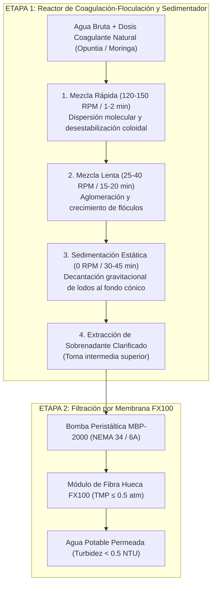
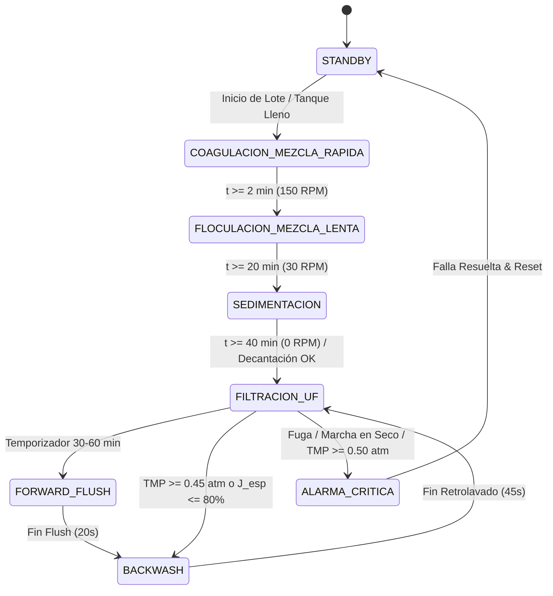

# DOCUMENTO MAESTRO: SISTEMA DE ULTRAFILTRACIÓN INDUSTRIAL V2
## Diseño de Ingeniería, Automatización Determinística e Instrumentación de Proceso
### Módulo de Ultrafiltración: Fresenius FX100 + Unidad de Coagulación-Sedimentación
### Enmarcado en Tesis de Grado y Tesis Doctoral

---

### 1. Marco Teórico y Arquitectura General del Proceso Híbrido

El sistema de tratamiento de agua turbia integra dos etapas secuenciales automatizadas:
1. **Etapa 1: Pre-tratamiento por Coagulación, Floculación y Sedimentación** (mediante coagulantes naturales y agitación controlada por RPM).
2. **Etapa 2: Módulo de Membrana de Ultrafiltración FX100** (pulido final de remoción bacteriana y macromolecular hasta nivel de potabilidad).

```
╔═══════════════════════════════════════════════════════════════════════════════════════════════╗
║                               ARQUITECTURA DEL PROCESO HÍBRIDO                                ║
╠═══════════════════════════════════════════════════════════════════════════════════════════════╣
║ [Agua Turbia] ──► [Reactor Coagulación/Sedimentador] ──► [Bomba MBP-2000] ──► [Filtro FX100] ║
║                   • Paleta Agitadora con medición RPM    • Nema 34 + DM860    • Q ≤ 0.5 L/min ║
║                   • Mezcla Rápida (120-150 RPM)                               • TMP ≤ 0.5 atm ║
║                   • Mezcla Lenta (25-40 RPM)                                                  ║
║                   • Sedimentación Estática (0 RPM)                                            ║
╚═══════════════════════════════════════════════════════════════════════════════════════════════╝
```

---

### 2. Unidad de Pre-Tratamiento: Coagulación, Floculación y Sedimentador



#### 2.1. Dinámica de Agitación y Gradiente de Velocidad ($G$)
* **Mezcla Rápida (Coagulación)**:
  * **Velocidad**: $120 \text{ a } 150\text{ RPM}$ (Gradiente $G \approx 300 - 500\text{ s}^{-1}$).
  * **Tiempo**: $60 \text{ a } 120\text{ segundos}$.
  * **Objetivo**: Dispersar de forma homogénea las cadenas de biopolímero para neutralizar las cargas superficiales de las partículas coloidales en suspensión.
* **Mezcla Lenta (Floculación)**:
  * **Velocidad**: $25 \text{ a } 40\text{ RPM}$ (Gradiente $G \approx 20 - 50\text{ s}^{-1}$).
  * **Tiempo**: $15 \text{ a } 20\text{ minutos}$.
  * **Objetivo**: Fomentar colisiones entre partículas desestabilizadas para formar flóculos de gran tamaño y alta velocidad de sedimentación, **evitando el esfuerzo de cizallamiento (*shear stress*) que rompería los flóculos**.
* **Sedimentación Estática**:
  * **Velocidad**: $0\text{ RPM}$ (paleta detenida).
  * **Tiempo**: $30 \text{ a } 45\text{ minutos}$.

#### 2.2. Instrumentación y Medición de RPM de la Paleta Agitadora (Componentes Locales)
* **Sensor de RPM (Velocidad de Giro)**:
  * **Módulo Sensor Óptico de Ranura FC-03 (LM393 + Disco Ranurado de 20 ranuras)**:
    * *Costo y Disponibilidad*: Extremadamente económico y disponible en **Mercado Libre Argentina**.
    * *Conexión al ESP32*: Salida digital conectada al pin `GPIO 23` con interrupción por flanco ascendente (`attachInterrupt(digitalPinToInterrupt(23), isr_pulso_paleta, RISING)`).
    * *Ecuación de RPM*:
      $$\text{RPM}_{\text{paleta}} = \left(\frac{\text{Pulsos en } 1\text{ segundo}}{20\text{ ranuras}}\right) \times 60$$
* **Accionamiento de la Paleta**:
  * Motorreductor DC 12V con control de velocidad por **PWM** a través de un transistor **MOSFET (LR7843 / AOD4184)** comandado por el ESP32, o un motor paso a paso **NEMA 17 con driver A4988**.

---

### 3. Matriz de Sensores Disponibles en Mercado Libre Argentina (100% Verificados)

```
┌──────────────────────────────────────────────────────────────────────────────────────────────────┐
│                           INSTRUMENTACIÓN SELECCIONADA (MERCADO ARGENTINO)                       │
├───────────────────────┬───────────────────────────────┬─────────────────┬────────────────────────┤
│ Variable / Función    │ Sensor Recomendado            │ Rango Óptimo    │ Disponibilidad Local   │
├───────────────────────┼───────────────────────────────┼─────────────────┼────────────────────────┤
│ Presión P1, P2, P3    │ Transductor Ind. Inox 0-1 bar │ 0 a 1.0 bar     │ Mercado Libre Arg      │
│ (Opción Alternativa)  │ Módulo MPS20N0040D (con HX710)│ 0 a 40 kPa      │ Mercado Libre Arg      │
│ Micro-Caudal Permeado │ YF-S401 (Turbina Microflujo)  │ 0.3 a 6.0 L/min │ Mercado Libre Arg (OK) │
│ Validación Gravimétrica│ Celda de Carga 1-2 kg + HX711│ 0 a 2000 g (dm/dt)│ Mercado Libre Arg    │
│ Medición RPM Paleta   │ Módulo Óptico FC-03 (LM393)   │ 0 a 5000 RPM    │ Mercado Libre Arg      │
│ Temperatura Agua (TCF)│ Sensor Sumergible DS18B20     │ -55 a +125 °C   │ Mercado Libre Arg      │
│ Turbidez del Agua     │ Módulo Sensor Turbidez Óptico │ 0 a 3000 NTU    │ Mercado Libre Arg      │
│ Nivel de Reservorios  │ Boyas Magnéticas Inox/PP      │ ON/OFF Digital  │ Mercado Libre Arg      │
│ Digitalizador 16-bit  │ Módulo ADC I2C ADS1115        │ 16-bit 4 canales│ Mercado Libre Arg      │
│ Válvulas de Purga/Perm│ Solenoide 12V/24V NC 1/4"     │ 0 a 8 bar       │ Mercado Libre Arg      │
│ Driver Electroválvulas│ Módulo MOSFET LR7843 (4 ch)   │ Optoacoplado    │ Mercado Libre Arg      │
└───────────────────────┴───────────────────────────────┴─────────────────┴────────────────────────┘
```

#### 3.1. Detalle del Transductor de Presión $0-1\text{ bar}$ (G1/4" Acero Inoxidable)
* **Disponibilidad**: Ampliamente disponible en Mercado Libre Argentina bajo la búsqueda *"transductor de presión 0-1 bar"* o *"transmisor de presión 1 bar"*.
* **Rango**: $0 \text{ a } 1.0\text{ bar}$ ($0 \text{ a } 100\text{ kPa} \approx 0.987\text{ atm}$).
  * Proporciona una escala ideal con $2\times$ de factor de seguridad para el límite de $0.5\text{ atm}$ del FX100.
* **Salida Analógica**: Típicamente $0.5\text{V} - 4.5\text{V}$ (o $4-20\text{ mA}$).
  * Conectado a los canales A0, A1 y A2 del conversor **ADS1115** (16 bits) para una resolución milimétrica de $\approx 0.015\text{ kPa}$ por cuenta.

#### 3.2. Módulo de Presión Alternativo de Ultra-Bajo Costo: `MPS20N0040D`
* **Rango**: $0 \text{ a } 40\text{ kPa}$ ($0 \text{ a } 0.395\text{ atm}$).
* **Sensor de puente piezorresistivo** acoplado al chip amplificador **HX710B / HX711**.
* *Ventaja*: Cuesta muy poco en Mercado Libre y su rango es ultra sensible en el tramo de ultrafiltración.

---

### 4. Modelado Matemático del Filtro FX100 y Ecuaciones para la Tesis

#### 4.1. Ecuación Fundamental de Transporte (Ley de Darcy)
$$J = \frac{Q_{\text{permeado}}}{A_m} = \frac{\text{TMP}}{\mu(T) \cdot R_t}$$
Donde:
* $J$: Flujo volumétrico de permeado $\left[\text{LMH} = \frac{\text{L}}{\text{m}^2 \cdot \text{h}}\right]$.
* $A_m$: Área interfacial del filtro FX100 ($2.2\text{ m}^2$).
* $\text{TMP}$: Presión Transmembrana:
  $$\text{TMP} = \left(\frac{P_{\text{feed}} + P_{\text{concentrado}}}{2}\right) - P_{\text{permeado}}$$
  > **Límite operacional crítico**: $\text{TMP} \le 0.50\text{ atm} \approx 50.66\text{ kPa}$.

#### 4.2. Compensación Térmica (TCF) y Flujo Específico Normalizado ($J_{\text{esp}}$)
$$\text{TCF} = \frac{\mu(T)}{\mu(20^\circ\text{C})} \approx \exp\left[ 0.0239 \cdot (20 - T_{\text{agua}}) \right]$$
$$J_{20} = J_T \cdot \text{TCF} \quad \left[\text{LMH}\right]$$
$$J_{\text{esp}} = \frac{J_{20}}{\text{TMP}} \quad \left[\frac{\text{LMH}}{\text{bar}}\right]$$

---

### 5. Diagrama P&ID Completo (Planta de Coagulación + Ultrafiltración)

```
                       PLANTA COMPLETA DE TRATAMIENTO HÍBRIDO
                       ══════════════════════════════════════

   [Agua Turbia]
         │
         ▼
 ┌──────────────────────────────┐
 │   REACTOR / SEDIMENTADOR     │
 │                              │
 │  [Paleta Agitadora] ◄────────┼── Motor DC/NEMA + Sensor Óptico FC-03 (RPM)
 │  [Sensor Nivel Boya]         │
 │  [Sensor Temp DS18B20]       │
 │                              │
 │  (Zona Sobrenadante Clarif.) ├────────────────────────┐
 │                              │                        │
 │  (Fondo Cónico de Purga Lodos)──► [Válvula Purga EV-0]│
 └──────────────────────────────┘                        ▼
                                                [Bomba Peristáltica] ◄─── NEMA 34 (4 Nm / 6 A)
                                                   (MBP-2000)             Driver DM860 (34V DC)
                                                         │
                                                         ├──────────► [Presión P1 - Transductor 0-1 bar]
                                                         │
                                                         ▼
                                              ┌──────────────────────┐
                                              │ MÓDULO HUECO FX100   │
                                              │                      ├──────► [Presión P2 - Concentrado]
                                              │ Entrada      Retenido│            │
                                              │ (Feed)     (Retentate)            ▼
                                              │                      │    [Electroválvula Purga EV-1] ──► [Recirculación]
                                              │      Permeado        │
                                              └──────────┬───────────┘
                                                         │
                                                         ├──────────► [Presión P3 - Permeado]
                                                         │
                                                         ▼
                                                  [Sensor Turbidez]
                                                         │
                                                         ▼
                                               [Micro-Caudal YF-S401]
                                               [o Celda Carga HX711]
                                                         │
                                                         ▼
                                               [Electroválvula EV-2]
                                                         │
                                                         ▼
                                                [Tanque Permeado]
```

---

### 6. Máquina de Estados Finitos Integrada (FSM Global)



---

### 7. Asignación de Pines Actualizada (ESP32 DevKit V1)

```
                       ESP32 DEVKIT V1 (30 PINES)
                            ┌──────────────┐
                     3V3 ───┤ 1         30 ├─── VIN (5V In)
                     GND ───┤ 2         29 ├─── GND
             [Libre] D36 ───┤ 3 (VP)    28 ├─── D13 [I2C SCK (ADS1115 + Pantalla)]
             [Libre] D39 ───┤ 4 (VN)    27 ├─── D12 [I2C SDA (ADS1115 + Pantalla)]
      [Temp DS18B20] D34 ───┤ 5         26 ├─── D14 [Sensor Fuga Base]
     [Sensor Turbidez] D35 ───┤ 6         25 ├─── D27 [Caudalímetro YF-S401]
          [Boya Nivel] D32 ───┤ 7         24 ├─── D26 [Válvula Purga Concentrado EV-1]
          [Boya Nivel] D33 ───┤ 8         23 ├─── D25 [Válvula Permeado EV-2]
       [Touch Botón] D25 ───┤ 9         22 ├─── D23 [Sensor Óptico RPM Paleta FC-03]
             [PWM EV0] D26 ───┤ 10        21 ├─── D21 [DM860 ENABLE]
                       D27 ───┤ 11        20 ├─── D19 [DM860 DIR]
       [PWM Paleta DC] D4  ───┤ 12        19 ├─── D18 [DM860 PULSE / STEP (NEMA 34)]
                       D12 ───┤ 13        18 ├─── D5  [Válvula Purga Lodos EV-0]
                       D13 ───┤ 14        17 ├─── TX0 [Serial Debug]
                       GND ───┤ 15        16 ├─── RX0 [Serial Debug]
                            └──────────────┘
```

---
*Documento Técnico Integrado - Versión 2.3.0 (Reactor de Coagulación/Sedimentador + Ultrafiltración FX100).*
