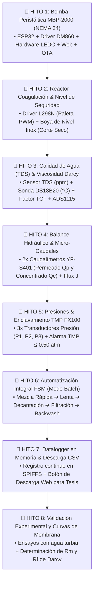

# 📘 DOCUMENTO MAESTRO: INVENTARIO, ARQUITECTURA Y GUÍA DE CONEXIONES
## Planta Piloto de Ultrafiltración Fresenius FX100 & Coagulación-Sedimentación
### Tesis de Grado en Ingeniería Industrial — Automatización con ESP32

---

# 📦 PARTE 1: INVENTARIO COMPLETO Y CONSOLIDADO

A continuación se detalla todo el hardware real existente, su función técnica y lo único pendiente:

### 🟢 1. Componentes Físicos en Mano (100% Disponibles en el Laboratorio)

| Componente | Cantidad | Especificaciones / Modelo | Función en la Planta Piloto | Hito |
| :--- | :---: | :--- | :--- | :---: |
| **1. Driver Leadshine DM860** | 1 | Microstepping 1600 P/R, AC/DC | Control de potencia optoacoplado para el motor NEMA 34. | **Hito 1** |
| **2. Motor Paso a Paso NEMA 34** | 1 | Bipolar 4.0 Nm, 4 cables | Accionamiento de alto torque para la bomba peristáltica MBP-2000. | **Hito 1** |
| **3. Bomba Peristáltica MBP-2000** | 1 | Cabezal con manguera de silicona | Impulsión estéril de precisión hacia la membrana ($0 \text{ a } 0.5\text{ L/min}$). | **Hito 1** |
| **4. Transformador AC** | 1 | Primario 220V ➔ Secundario AC | Alimentación exclusiva para los bornes `AC/AC` del driver DM860. | **Hito 1** |
| **5. Driver Puente H L298N** | 1 | Doble puente H 2A con disipador | Modulación PWM de velocidad y sentido para el motor de la paleta. | **Hito 2** |
| **6. Sensor de Nivel de Acero Inox.** | 1 | Boya flotante 100mm (N/C - N/A) | Detección de nivel mínimo/máximo en el reactor para evitar marcha en seco. | **Hito 2** |
| **7. Sensor de Temp. DS18B20** | 1 | Sonda sumergible digital OneWire | Mide temperatura ($^\circ\text{C}$) para calcular la viscosidad y el factor TCF de Darcy. | **Hito 3** |
| **8. Caudalímetros YF-S401** | 2 | $0.3 \text{ a } 6\text{ L/min}$ (Efecto Hall) | Medición de flujo en línea: Permeado ($Q_p$) y Retentado/Alimentación ($Q_c$). | **Hito 4** |
| **9. Conversor ADC ADS1115** | 1 | 16-Bit I2C de 4 canales ($A_0 - A_3$) | Lectura de altísima resolución sin ruido para presiones y calidad de agua. | **Hito 3/5** |
| **10. Módulo Step-Down LM2596** | 1 | $3\text{A}$ CC/CV Regulable | Baja los $12\text{V DC}$ a $5.00\text{V DC}$ estables para alimentar el ESP32. | **Energía** |
| **11. Fuente de Alimentación 12V** | 1 | $12\text{V DC} - 1.5\text{A}$ ($18\text{W}$) | Alimentación de corriente continua para L298N, LM2596 y sensores. | **Energía** |
| **12. Conectores Empalme Rápido** | 100 | Bloques dobles a presión | Conexiones firmes, seguras y limpias para masa común y líneas de poder. | **Montaje** |
| **13. Base Shield Expansión ESP32** | 1 | USB-C / Micro-USB 38 pines | Placa de soporte y expansión para el ESP32. | **Montaje** |
| **14. Membrana Fresenius FX100** | 1 | Capilares Polisulfona ($A_m=2.2\text{ m}^2$) | Módulo central de ultrafiltración ($0.01\,\mu\text{m}$) para potabilización. | **Planta** |

---

### 🚚 2. Componentes en Tránsito (Comprados)

| Componente | Cantidad | Función en la Planta |
| :--- | :---: | :--- |
| **15. ESP32 NodeMCU (38 Pines USB-C)** | 1 | Microcontrolador central (Wi-Fi, WebServer, OTA, LEDC Timer de hardware). |
| **16. Sensor TDS (Calidad de Agua)** | 1 | Sonda sumergible analógica para medir Sólidos Totales Disueltos ($\text{ppm}$) según Código Alimentario. |

---

### 🟡 3. Lo ÚNICO que Falta Conseguir (Para el Cierre del Sistema)

1. **3x Transductores de Presión Hidráulica ($0 \text{ a } 1.2\text{ bar}$ / $0 \text{ a } 17\text{ PSI}$, rosca G1/4")**:
   * Para medir $P_1$ (Entrada), $P_2$ (Retentado) y $P_3$ (Permeado) y calcular la Presión Transmembrana ($\text{TMP} \le 0.50\text{ atm}$).
2. **Accesorios de Ferretería e Hidráulica**:
   * Mangueras de silicona transparente (diámetro $6\text{ mm}$ u $8\text{ mm}$ interior).
   * 3 Tees plásticas o de latón rosca G1/4" con espigas para derivar las tomas de los sensores de presión.
   * Válvulas manuales tipo esclusa/esféricas miniatura para regular el retentado.

---

# 🚀 PARTE 2: REPLANIFICACIÓN DE LOS 8 HITOS (DESDE 0)



---

# 🔌 PARTE 3: GUÍA PASO A PASO DE CONEXIONADO FÍSICO

### 1. Preparación de la Fuente de 12V 1.5A DC
1. Si usas el cable pelado de la fuente:
   * Mide con el multímetro en **DCV 20V**:
     * Punta roja al positivo, punta negra al negativo $\rightarrow$ El tester debe marcar **`+12.0 V`**.
   * Identifica y marca el cable **POSITIVO (+12V)** y el **NEGATIVO (GND / 0V)**.

---

### 2. Calibración del Módulo LM2596 (12V ➔ 5.00V)
1. Conecta el cable **+12V** al borne `IN+` del LM2596.
2. Conecta el cable **GND (0V)** al borne `IN-` del LM2596.
3. Enchufa la fuente de 12V a 220V.
4. Mide con el multímetro los bornes de salida `OUT+` y `OUT-`.
5. Gira el tornillo de bronce del potenciómetro azul en sentido antihorario hasta que la salida marque **`5.00 V`** exactos.
6. **Desenchufa la fuente de 220V**.

---

### 3. Esquema Unificado de Alimentación y Masa Común (GND)

```
                            DISTRIBUCIÓN DE ENERGÍA Y MASAS
                            ================================

                           [ FUENTE 12V 1.5A DC ]
                             (+)             (-)
                              │               │
           ┌──────────────────┘               └──────────────────┐
           │                                                     │
           ▼                                                     ▼
   [ L298N: Borne +12V ]                                 [ L298N: Borne GND ]
           │                                                     │
           │ (Puentecito de cable)                               │ (2 cables juntos en el borne)
           ▼                                                     ▼
   [ LM2596: Borne IN+ ]                                 [ LM2596: Borne IN- ]
           │                                                     │
           ▼                                                     ▼
   [ LM2596: Borne OUT+ (5.0V) ]                         [ LM2596: Borne OUT- (0V) ]
           │                                                     │
           ▼                                                     ▼
   [ ESP32: Pin VIN (5V) ]                               [ ESP32: Pin GND ]
                                                                 │
                                                                 ├─► Driver DM860: Bornes PUL- y DIR-
                                                                 ├─► Driver L298N: Borne GND
                                                                 ├─► Sensor Nivel: 1 cable a GND
                                                                 ├─► DS18B20: Cable Negro (GND)
                                                                 ├─► Sensor TDS: Pin GND
                                                                 ├─► Caudalímetros: Cable Negro
                                                                 └─► Módulo ADS1115: Pin GND
```

---

### 4. Conexionado de Actuadores y Sensores al ESP32

```
                                 ASIGNACIÓN DE CABLEADO AL ESP32
                                 ================================

 [A] BOMBA NEMA 34 (DRIVER DM860)
     • GPIO 18 (D18) ────────► PUL+ del DM860 (Pulsos STEP por hardware LEDC)
     • GPIO 19 (D19) ────────► DIR+ del DM860 (Dirección de giro CW/CCW)
     • GND del ESP32 ────────► PUL- y DIR- del DM860 (Masa Cátodo Común)
     • Bornes AC / AC ───────► Salida directa del Transformador AC
     • Bornes A+/A- y B+/B- ─► Las dos fases del motor NEMA 34
     • NOTA: SW4 del DM860 colocado en posición OFF (elimina calentamiento).

 [B] AGITADOR COAGULACIÓN (DRIVER L298N)
     • GPIO 4 (D4)   ────────► Pin ENA del L298N (PWM de Velocidad - Quitar jumper negro)
     • GPIO 16 (D16) ────────► Pin IN1 del L298N (Sentido de Giro A)
     • GPIO 17 (D17) ────────► Pin IN2 del L298N (Sentido de Giro B)
     • Bornes OUT1 / OUT2 ───► Los 2 cables del motor DC de la paleta

 [C] SENSOR DE NIVEL DE AGUA EN ACERO INOXIDABLE (BOYA)
     • Cable 1 de la Boya ───► GPIO 32 del ESP32 (con INPUT_PULLUP interno)
     • Cable 2 de la Boya ───► GND del ESP32
     • Función: Si el nivel baja del mínimo, el ESP32 frena la bomba inmediatamente.

 [D] SENSOR DE TEMPERATURA SUMERGIBLE DS18B20
     • Cable Rojo ───────────► Pin 3V3 del ESP32 (3.3V)
     • Cable Negro ──────────► Pin GND del ESP32
     • Cable Amarillo ───────► GPIO 34 del ESP32 (Datos OneWire)
     • (Colocar resistencia de 4.7 kΩ entre cable Rojo 3.3V y cable Amarillo Datos)

 [E] SENSOR DE CALIDAD DE AGUA TDS (SÓLIDOS TOTALES DISUELTOS)
     • Pin VCC ──────────────► Pin 3V3 del ESP32
     • Pin GND ──────────────► Pin GND del ESP32
     • Pin AOUT (Señal) ─────► Canal A0 del Conversor ADS1115 (o GPIO 35)

 [F] CAUDALÍMETROS DE AGUA YF-S401 (x2)
     • Caudalímetro Permeado (Qp)  ──► Cable Amarillo a GPIO 27 (Pulsos)
     • Caudalímetro Retentado (Qc) ──► Cable Amarillo a GPIO 14 (Pulsos)
     • Cables Rojos a 3.3V / 5V, Cables Negros a GND.

 [G] MÓDULO CONVERSOR ADC ADS1115 (16 BITS I2C)
     • Pin VDD ──────────────► Pin 3V3 del ESP32
     • Pin GND ──────────────► Pin GND del ESP32
     • Pin SCL ──────────────► GPIO 22 del ESP32 (I2C Clock)
     • Pin SDA ──────────────► GPIO 21 del ESP32 (I2C Data)
     • Pin ADDR ─────────────► Conectado a GND (Dirección I2C: 0x48)
```

---

## 📌 TABLA RESUMEN DE PINES ESP32 (38 PINES)

| Pin ESP32 | Etiqueta Código | Función en la Planta Piloto | Tipo de Señal |
| :--- | :--- | :--- | :--- |
| **GPIO 18** | `PIN_PUL` | **Bomba NEMA 34 (Pulsos STEP)** | Salida Hardware LEDC Timer |
| **GPIO 19** | `PIN_DIR` | **Bomba NEMA 34 (Dirección)** | Salida Digital |
| **GPIO 4** | `PIN_AGIT_PWM` | **Agitador L298N (Velocidad ENA)** | Salida PWM (0 a 255) |
| **GPIO 16** | `PIN_AGIT_IN1` | **Agitador L298N (Giro Adelante)** | Salida Digital |
| **GPIO 17** | `PIN_AGIT_IN2` | **Agitador L298N (Giro Atrás)** | Salida Digital |
| **GPIO 32** | `PIN_NIVEL_BOYA` | **Sensor de Nivel Flotante (Seguridad)** | Entrada Digital Pull-Up |
| **GPIO 34** | `PIN_TEMP_DS18B20` | **Sensor Temperatura DS18B20** | Protocolo OneWire |
| **GPIO 27** | `PIN_CAUDAL_PERM` | **Caudalímetro Permeado YF-S401** | Interrupción por Flanco |
| **GPIO 14** | `PIN_CAUDAL_RET` | **Caudalímetro Retentado YF-S401** | Interrupción por Flanco |
| **GPIO 21** | `I2C_SDA` | **Bus I2C (Conversor ADS1115)** | Comunicación I2C |
| **GPIO 22** | `I2C_SCL` | **Bus I2C (Conversor ADS1115)** | Comunicación I2C |
| **VIN (5V)** | `ALIMENTACION` | **Entrada 5.00V desde LM2596** | Alimentación de Potencia |
| **GND** | `MASA_COMUN` | **Masa Unificada de la Planta** | Referencia 0V |

---
*Documento Técnico de Referencia — Tesis de Grado en Ingeniería Industrial*
