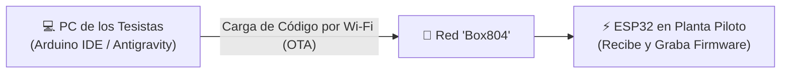

# 📘 GUÍA TÉCNICA Y PEDAGÓGICA PARA TESISTAS
## Proyecto de Tesis: Planta Piloto de Coagulación-Sedimentación y Ultrafiltración (FX100)
### Dirección de Tesis & Equipo de Investigación | Automatización con ESP32

---

### 🎯 Bienvenida al Equipo de Tesis

Estimados tesistas: este proyecto tiene como objetivo diseñar, instrumentar, automatizar y validar experimentalmente una **planta piloto híbrida de potabilización de agua turbia**. 

Integraremos dos etapas principales:
1. **Pre-Tratamiento Fisicoquímico**: Reactor de Coagulación / Floculación con coagulantes naturales (*Opuntia / Moringa*) y Sedimentador Cónico de acero inoxidable.
2. **Tratamiento Avanzado por Membrana**: Módulo de Ultrafiltración de fibra hueca **Fresenius FX100** impulsado por una bomba peristáltica de alta precisión (**NEMA 34 + Driver DM860**).

Trabajaremos con una **metodología incremental por hitos (8 Hitos)**. Cada hito tiene un fundamento físico-químico, un diseño de conexionado electrónico, un firmware no bloqueante para ESP32 y un conjunto de datos experimentales que formarán los capítulos de su tesis.

```
╔═══════════════════════════════════════════════════════════════════════════════════════════════════╗
║                                  ARQUITECTURA DEL SISTEMA PILOTO                                  ║
╠═══════════════════════════════════════════════════════════════════════════════════════════════════╣
║ [Agua Bruta] ──► [Sedimentador Cónico] ──► [Bomba Peristáltica] ──► [Filtro FX100] ──► [Permeado] ║
║                  • Agitador DC + FC-03     • NEMA 34 (4 Nm)         • P1, P2, P3       (Agua      ║
║                  • G = 300 s⁻¹ / 40 s⁻¹    • Driver DM860 (34V)     • TMP ≤ 0.5 atm     Potable)  ║
╚═══════════════════════════════════════════════════════════════════════════════════════════════════╝
```

---

## 🛠️ 1. Configuración del Entorno de Trabajo en sus PCs

Para trabajar de manera 100% coordinada con la dirección de tesis y con Antigravity, cada tesista debe seguir estos pasos en su computadora:

### Paso 1.1: Instalar Arduino IDE y soporte ESP32
1. Descargar e instalar **Arduino IDE 2.x** desde [arduino.cc](https://www.arduino.cc/en/software).
2. Abrir Arduino IDE e ir a `Archivo` ➔ `Preferencias` (o `Ctrl + Coma`).
3. En el campo **"Gestor de URLs Adicionales de Tarjetas"**, pegar la URL oficial de Espressif:
   ```text
   https://raw.githubusercontent.com/espressif/arduino-esp32/gh-pages/package_esp32_index.json
   ```
4. Ir al menú lateral izquierdo **"Gestor de Placas"** (Boards Manager), buscar `esp32` e instalar **`esp32 by Espressif Systems`**.

### Paso 1.2: Instalar Librerías Requeridas en Arduino IDE
Ir a `Herramientas` ➔ `Administrar Bibliotecas...` (o `Ctrl + Shift + I`) e instalar:
1. **`ESPAsyncWebServer`** (by me-no-dev o lacamera)
2. **`AsyncTCP`** (by me-no-dev o dvarrel)
3. **`Adafruit ADS1X15`** (para el digitalizador I2C de 16 bits)
4. **`OneWire`** y **`DallasTemperature`** (para la sonda sumergible DS18B20)

*(Nota: La librería `ArduinoOTA.h` y `WiFi.h` ya vienen incluidas de forma nativa al instalar el paquete del ESP32).*

---

## 📶 2. El Flujo de Carga Inalámbrica por Wi-Fi (OTA: Over-The-Air)

A partir del **Hito 1**, el ESP32 cuenta con **ArduinoOTA** activado. Esto significa que **ya no necesitan conectar el cable USB cada vez que quieran probar un código nuevo**:



### ¿Cómo cargar un código por Wi-Fi?
1. Asegúrense de que su PC esté conectada a la red Wi-Fi: **`Box804`** (Clave: `plantapiloto2`).
2. En Arduino IDE, vayan a `Herramientas` ➔ `Puerto`.
3. Verán una nueva sección llamada **"Network Ports"** (Puertos de Red) con el nombre:
   ```text
   bomba-uf at 192.168.x.x
   ```
4. Seleccionan ese puerto y hacen clic en **Subir (➔)**. Arduino IDE les pedirá la contraseña OTA: escribir `plantapiloto2`.
5. ¡Listo! El ESP32 se reprograma por el aire en pocos segundos.

---

## 🚀 3. Mapa de Ruta de los 8 Hitos de Tesis

A continuación se detalla cada hito con sus objetivos de ingeniería, hardware, conexiones y datos para el informe de tesis:

---

### 🎯 HITO 1: Accionamiento de Precisión MBP-2000 (NEMA 34) + Dashboard Web + OTA
* **Objetivo**: Controlar la velocidad exacta de giro de la bomba peristáltica (0 a 120 RPM) con rampa de aceleración suave ($35\text{ RPM/s}$), inversión de sentido y panel táctil web.
* **Hardware**: ESP32 DevKit V1, Driver Leadshine DM860 (configurado en 1600 micropasos/rev, SW4 en OFF), Motor NEMA 34 Bipolar (4.0 Nm), Transformador AC a bornes `AC/AC`.
* **Pines Físicos (Cableado Real de Planta)**:
  * `GPIO 18` (D18) $\rightarrow$ `PUL+` (Paso / STEP del DM860).
  * `GPIO 19` (D19) $\rightarrow$ `DIR+` (Dirección / Sentido de giro).
  * `GND` $\rightarrow$ `PUL-` y `DIR-` (Cátodo Común).
* **Fundamento Físico**:
  $$f_{\text{pulso}} (\text{Hz}) = \frac{\text{RPM} \times 1600}{60} = \text{RPM} \times 26.6667\text{ Hz}$$
* **Acceso**: Abrir en el navegador `http://bomba-uf.local` o la IP local.
* **Entregable para la Tesis**: Curva de respuesta en escalón de RPM vs. Tiempo demostrando la ausencia de pérdida de pasos con la rampa de aceleración.

---

### 🎯 HITO 2: Reactor de Coagulación (L298N) & Boya de Nivel de Seguridad
* **Objetivo**: Implementar el accionamiento de la paleta agitadora con modulación PWM y proteger el sistema contra marcha en seco mediante sensor de nivel flotante de acero inoxidable.
* **Hardware**: Driver Puente H L298N, Motor DC 12V con paleta, Sensor de nivel de acero inoxidable 100mm (Boya flotante), Módulo Step-Down LM2596 (12V ➔ 5.0V).
* **Pines Físicos**:
  * `GPIO 4` $\rightarrow$ Pin `ENA` del L298N (PWM de velocidad del motor).
  * `GPIO 16` $\rightarrow$ Pin `IN1` del L298N (Sentido de giro A).
  * `GPIO 17` $\rightarrow$ Pin `IN2` del L298N (Sentido de giro B).
  * `GPIO 32` $\rightarrow$ Boya de nivel de acero inoxidable (Entrada digital con `INPUT_PULLUP`).
* **Secuencia FSM del Reactor**:
  * **Mezcla Rápida**: $150\text{ RPM}$ ($G \approx 400\text{ s}^{-1}$) durante $60\text{ s}$.
  * **Mezcla Lenta**: $30\text{ RPM}$ ($G \approx 35\text{ s}^{-1}$) durante $15\text{ min}$.
  * **Sedimentación Estática**: $0\text{ RPM}$ ($30\text{ min}$).

---

### 🎯 HITO 3: Calidad de Agua (Sensor TDS) y Viscosidad Darcy (DS18B20)
* **Objetivo**: Medir Sólidos Totales Disueltos ($\text{ppm}$) en agua cruda y permeado, y registrar la temperatura para la corrección de viscosidad de Darcy.
* **Hardware**: Sensor analógico TDS con sonda sumergible, Sonda de temperatura digital DS18B20 sumergible, Conversor ADC ADS1115 (16 bits).
* **Pines**:
  * `GPIO 34` $\rightarrow$ Sonda DS18B20 (Datos OneWire con pull-up $4.7\text{ k}\Omega$).
  * `GPIO 21` (SDA) y `GPIO 22` (SCL) $\rightarrow$ Bus I2C hacia el ADS1115.
  * Canal `A0` del ADS1115 $\rightarrow$ Señal analógica del Sensor TDS.
* **Fórmula de Compensación Térmica**:
  $$\text{TCF} = \exp\left[ 0.0239 \cdot (20 - T_{\text{agua}}) \right]$$

---

### 🎯 HITO 4: Balance Hidráulico en Línea y Micro-Caudales (2x YF-S401)
* **Objetivo**: Medir simultáneamente el caudal de agua permeada ($Q_p$) y el caudal de retentado ($Q_c$) para calcular la tasa de recuperación volumétrica ($Y$) y el Flux de membrana ($J$).
* **Hardware**: 2 Caudalímetros de turbina microflujo YF-S401 ($0.3 \text{ a } 6\text{ L/min}$).
* **Pines**:
  * `GPIO 27` $\rightarrow$ Pulsos Caudalímetro Permeado ($Q_p$).
  * `GPIO 14` $\rightarrow$ Pulsos Caudalímetro Retentado ($Q_c$).
* **Modelado de Flujo (Ley de Darcy)**:
  $$J_{20} = \left(\frac{Q_p \times 60}{A_m}\right) \times \text{TCF} \quad \left[\frac{\text{L}}{\text{m}^2\cdot\text{h}}\right]$$
  $$Y (\%) = \left(\frac{Q_p}{Q_p + Q_c}\right) \times 100$$

---

### 🎯 HITO 5: Presiones y Enclavamiento de Seguridad TMP FX100
* **Objetivo**: Medir $P_1, P_2, P_3$ mediante 3 transductores hidráulicos ($0-1.2\text{ bar}$) y calcular en tiempo real la Presión Transmembrana ($\text{TMP} \le 0.50\text{ atm}$).
* **Hardware**: 3 Transductores de presión G1/4", Conversor ADS1115 (Canales `A1`, `A2`, `A3`).
* **Ecuación Fundamental**:
  $$\text{TMP} = \left(\frac{P_1 + P_2}{2}\right) - P_3 \quad \le 0.50\text{ atm } (\approx 50.66\text{ kPa})$$
* **Enclavamiento Automático**: Si $\text{TMP} > 0.50\text{ atm}$, el microcontrolador frena la bomba en $< 50\text{ ms}$.

---

### 🎯 HITO 6: Automatización Integral FSM (Modo Batch)
* **Objetivo**: Integrar la máquina de estados completa: *Llenado ➔ Mezcla Rápida ➔ Floculación Lenta ➔ Decantación ➔ Ultrafiltración FX100 ➔ Retrolavado (Backwash)*.

---

### 🎯 HITO 7: Datalogger Integrado y Descarga CSV
* **Objetivo**: Almacenar los ensayos en la memoria Flash del ESP32 y permitir la descarga de `ensayo_ultrafiltracion.csv` desde el dashboard web por Wi-Fi.

---

### 🎯 HITO 8: Validación Experimental y Curvas de Membrana
* **Objetivo**: Montaje final en tablero industrial, ensayos con agua turbia y determinación experimental de la resistencia de membrana ($R_m$) y ensuciamiento ($R_f$) para el informe final de tesis.

---
*Documento de Trabajo de Cátedra y Tesis de Grado. Versión 2.0.*
