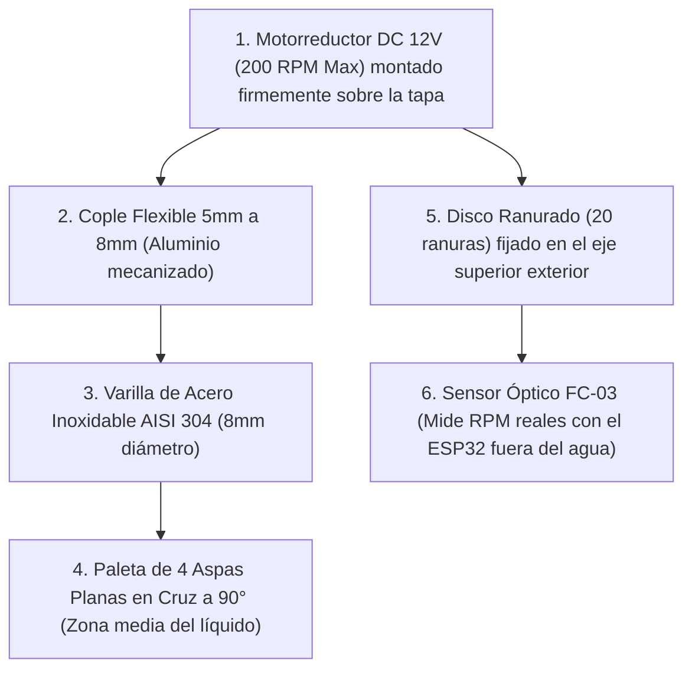

# GUÍA MAESTRA DE IMPLEMENTACIÓN POR HITOS: SISTEMA UF INDUSTRIAL V2
## Manual Pedagógico y de Ingeniería Paso a Paso para Alumnos y Dirección de Tesis
### Planta Piloto de Coagulación-Sedimentación y Ultrafiltración (FX100) | ESP32 DevKit V1

---

### 🎓 Mensaje Pedagógico Inicial (Del Profesor / Experto hacia el Equipo)

Bienvenidos a la guía técnica modular del proyecto. Como equipo de investigación (dirección de tesis y alumnos tesistas), abordaremos este desarrollo desde los **principios fundamentales de la física de fluidos, la ingeniería mecánica, la electrónica analógica y el software embebido**.

Cada duda que surja (desde cómo roscar un sensor hasta cómo el microcontrolador cuenta pulsos) se explicará paso a paso con esquemas claros.

```
╔═══════════════════════════════════════════════════════════════════════════════════════════════════╗
║                                 FILOSOFÍA DE TRABAJO MODULAR                                      ║
╠═══════════════════════════════════════════════════════════════════════════════════════════════════╣
║ 1. Construir de a un hito a la vez.                                                               ║
║ 2. Entender el "por qué" antes de pasar al siguiente módulo.                                      ║
║ 3. Probar y validar experimentalmente cada hito en el banco de trabajo antes de complejizar.      ║
║ 4. Documentar los datos de cada hito para los capítulos de la tesis de grado y tesis doctoral.   ║
╚═══════════════════════════════════════════════════════════════════════════════════════════════════╝
```

---

## 🛒 GUÍA DE COMPRAS Y VALIDACIÓN DE ARTÍCULOS EN MERCADO LIBRE

> 💡 **Modalidad de Compra Asistida**: Puedes enviarme los links de las publicaciones de Mercado Libre Argentina que encuentres. Analizaré la hoja de datos técnica (*datasheet*), roscas, voltajes y rangos para confirmarte si es el producto exacto antes de que realicen la compra.

┌─────────────────────────────────────────────────────────────────────────────────────────────────────────────────────────────────────┐
│                                            ESTADO DE COMPRAS EN MERCADO LIBRE ARGENTINA                                             │
├───────────────────────────────┬──────────────────────────────────┬──────────┬─────────────────┬────────────────┬────────────────────┤
│ Componente / Sensor           │ Publicación / Modelo ML          │ Cantidad │ Rango / Medida  │ Estado Compra  │ Justificación      │
├───────────────────────────────┼──────────────────────────────────┼──────────┼─────────────────┼────────────────┼────────────────────┤
│ 1. Mother Shield Borneras     │ Placa Screw Shield ESP32 38 pin  │ 1 unid.  │ 38 pines bornera│ ✅ COMPRADO    │ Conexión segura.   │
├───────────────────────────────┼──────────────────────────────────┼──────────┼─────────────────┼────────────────┼────────────────────┤
│ 2. Sensor Nivel Inox 100mm    │ Flotante Inox 100mm NA/NC        │ 1 unid.  │ Vástago 100 mm  │ ✅ COMPRADO    │ Tapa sedimentador. │
├───────────────────────────────┼──────────────────────────────────┼──────────┼─────────────────┼────────────────┼────────────────────┤
│ 3. Digitalizador ADS1115      │ Módulo ADC 16-bit I2C            │ 1 unid.  │ 4 canales 16-bit│ ✅ COMPRADO    │ Lectura P1,P2,P3,NTU│
├───────────────────────────────┼──────────────────────────────────┼──────────┼─────────────────┼────────────────┼────────────────────┤
│ 4. Micro-Caudalímetro YF-S401 │ Duaitek YF-S401 (MLA27393316)    │ 1 unid.  │ 0.3 a 6.0 L/min │ 🛒 EN CARRITO  │ Permeado FX100.    │
├───────────────────────────────┼──────────────────────────────────┼──────────┼─────────────────┼────────────────┼────────────────────┤
│ 5. Sensor Temp. DS18B20       │ DS18B20 Sumergible Inox          │ 1 unid.  │ -55 a +125 °C   │ 🛒 EN CARRITO  │ Compensación TCF.  │
├───────────────────────────────┼──────────────────────────────────┼──────────┼─────────────────┼────────────────┼────────────────────┤
│ 6. Válvula Solenoide 12V NC   │ Solenoide 12V Agua (MLA22672458) │ 2 unid.  │ 12V NC          │ 🛒 EN CARRITO  │ Purga y Permeado.  │
├───────────────────────────────┼──────────────────────────────────┼──────────┼─────────────────┼────────────────┼────────────────────┤
│ 7. Transductor Presión 30 psi │ Transductor 0-5V (MLAU3917096767)│ 3 unid.  │ 0 a 30 psi      │ ⏳ Pendiente    │ P1, P2 y P3.       │
├───────────────────────────────┼──────────────────────────────────┼──────────┼─────────────────┼────────────────┼────────────────────┤
│ 8. Sensor Óptico FC-03        │ Encoder FC-03 con Disco Acero    │ 1 unid.  │ 20 ranuras      │ ⏳ Pendiente    │ RPM de la paleta.  │
├───────────────────────────────┼──────────────────────────────────┼──────────┼─────────────────┼────────────────┼────────────────────┤
│ 9. Sensor de Turbidez         │ Sonda TS-300B / Gravity          │ 1 unid.  │ 0 a 3000 NTU    │ ⏳ Pendiente    │ Turbidez permeado. │
├───────────────────────────────┼──────────────────────────────────┼──────────┼─────────────────┼────────────────┼────────────────────┤
│ 10. Módulo MOSFET LR7843      │ Módulo MOSFET 4 canales          │ 1 unid.  │ 12V/24V hasta 15A│ ⏳ Pendiente   │ Válvulas y paleta. │
└───────────────────────────────┴───────────────────────────────┴──────────┴─────────────────┴────────────────┴────────────────────┘

---

## 🔧 GUÍA DE MONTAJE HIDRÁULICO Y CONEXIÓN DE SENSORES

Muchos investigadores y alumnos se preguntan: *¿Cómo se insertan estos sensores en las mangueras de agua y tanques? ¿Van como un manómetro común?* 

Aquí está la explicación física y mecánica detallada:

---

### 1. ¿Cómo se Conectan los Transductores de Presión ($P_1, P_2, P_3$)?

```
                            MONTAJE DE TRANSDUCTOR DE PRESIÓN EN TEE
                           ═════════════════════════════════════════

                                [Transductor de Presión 0-1 bar]
                                (Cuerpo de Acero Inoxidable)
                                            │
                                            │ Rosca Macho G1/4" (con teflón)
                                            ▼
                                   ┌─────────────────┐
                                   │  Tee Derivación │
                                   │  Rosca H 1/4"   │
   [Manguera Entrada] ────────────►│                 ├────────────► [Manguera Salida hacia Filtro]
   (Agua circulando)     Espiga 6mm└─────────────────┘Espiga 6mm    (Presión sensada en la T)
```

* **Instalación Hidráulica**:
  * Se instalan **exactamente igual que un manómetro industrial tradicional**.
  * En el tramo de manguera (de silicona o poliuretano de $6\text{ mm}$ u $8\text{ mm}$) se corta la manguera y se coloca una **Tee (T) de derivación**.
  * La Tee tiene dos extremos con espiga para la manguera y una boca central con **rosca hembra de 1/4"**.
  * El transductor de presión se enrosca en esa boca con cinta de teflón para asegurar estanqueidad total. El agua pasa de largo por la línea principal y la presión empuja el diafragma sensor de la Tee.
* **Conexión Eléctrica al ESP32**:
  * El transductor tiene 3 cables:
    * **Rojo**: $+5\text{V}$ (Alimentación).
    * **Negro**: $\text{GND}$ (Masa común).
    * **Amarillo / Blanco**: Señal analógica ($0.5\text{V} \text{ a } 4.5\text{V}$).
  * Los cables de señal de los 3 transductores van a las entradas **A0 ($P_1$), A1 ($P_2$), A2 ($P_3$)** del módulo **ADS1115**.
  * El ADS1115 se comunica con el ESP32 por solo 2 cables digitales I2C (`SDA = GPIO 21`, `SCL = GPIO 22`).

---

### 2. ¿Cómo se Conecta el Micro-Caudalímetro (`YF-S401`)?

```
                      MONTAJE EN SERIE DEL CAUDALÍMETRO YF-S401
                     ═══════════════════════════════════════════

   [Salida Permeado FX100] ──► [Espiga 6mm In] ──► [Rotor de Turbina] ──► [Espiga 6mm Out] ──► [Tanque Permeado]
                               (Entrada)              (Efecto Hall)       (Salida)
```

* **Instalación Hidráulica**:
  * Se instala **en serie** (en línea recta) sobre la manguera de salida de agua permeada limpia del filtro FX100.
  * El cuerpo del sensor tiene una flecha grabada que indica el sentido de circulación del líquido.
  * Se conectan las mangueras de $6\text{ mm}$ a las dos espigas con abrazaderas plásticas.
* **Conexión Eléctrica al ESP32**:
  * **Rojo**: $+5\text{V}$ o $+3.3\text{V}$.
  * **Negro**: $\text{GND}$.
  * **Amarillo**: Señal de pulsos digitales $\rightarrow$ Conectado a **GPIO 27** (o pin libre) del ESP32 con interrupción de hardware.

---

### 3. ¿Cómo se Conectan los Sensores de Nivel (Boyas)?

```
                       MONTAJE DE BOYAS DE NIVEL EN TANQUE
                      ═════════════════════════════════════

        Tanque Acero Inox
       ┌────────────────────────┐
       │ ┌─[Boya Nivel Alto]    │  ◄── Tuerca pasamuros en pared lateral o tapa
       │ │  (Flotador magnético)│
       │ │                      │
       │ │                      │
       │ │                      │
       │ └─[Boya Nivel Bajo]    │  ◄── Avisa antes de que se vacíe el tanque
       │    (Evita marcha seco) │
       └────────────────────────┘
```

* **Instalación Física**:
  * **Boya Lateral (Horizontal)**: Se realiza una perforación de $16\text{ mm}$ en la pared del tanque a la altura deseada y se enrosca con su tuerca y junta de silicona estanca desde el exterior.
  * **Boya Vertical**: Se suspende desde la tapa superior del tanque mediante una varilla roscada.
* **Conexión Eléctrica al ESP32**:
  * Las boyas son interruptores magnéticos de contacto seco (*Reed Switch*, 2 cables):
    * Un cable va a **GND**.
    * El otro cable va al pin del ESP32 (**GPIO 32** para nivel alto, **GPIO 33** para nivel bajo) con resistencia pull-up interna activada (`INPUT_PULLUP`).
    * Cuando el agua sube, el flotador magnético cierra el contacto y el ESP32 lee `LOW` ($0\text{V}$). Cuando el agua baja, lee `HIGH` ($3.3\text{V}$).

---

### 4. ¿Cómo se Conectan el Sensor de Turbidez y Temperatura?

* **Sensor de Temperatura `DS18B20`**:
  * Sonda cilíndrica de acero inoxidable de $6\text{ mm}$. Se sumerge directamente dentro del sedimentador o se fija con un prensaestopas plástico en la tapa.
  * Conexión: 3 cables (`VCC=3.3V`, `GND`, `Datos=GPIO 34` con resistencia pull-up de $4.7\text{ k}\Omega$).
* **Sensor de Turbidez**:
  * La sonda óptica en forma de U se sumerge en el vaso de recolección de permeado para medir la claridad del agua tratada. Su placa adaptadora se conecta al canal **A3 del ADS1115**.

---

## ⚙️ DISEÑO MECÁNICO DEL AGITADOR EN EL SEDIMENTADOR CÓNICO DE ACERO INOXIDABLE

Para un sedimentador cónico que procesará **agua turbia de río con coagulante natural** (*Opuntia ficus-indica* / *Moringa*):



```
                     MONTAJE DEL AGITADOR EN SEDIMENTADOR CÓNICO
                    ═════════════════════════════════════════════

                       [Motorreductor DC 12V]
                       [+ Disco FC-03 Óptico]
                                 │ (Eje 5mm)
                     ────────────▼────────────  ◄── Tapa Superior Acero Inox
                     │ [Cople Flexible 5 a 8] │
                     ─────────────────────────
                                 │
                                 │ (Varilla Inox 8mm suspendida)
                                 │
           ┌─────────────────────┼─────────────────────┐
           │                     │                     │
           │             ┌───────┴───────┐             │
           │             │ Paleta 4 Aspas│             │ ◄── Zona Media (Mezcla y Floculación)
           │             │  (60 x 30 mm) │             │     (Sin romper flóculos)
           │             └───────────────┘             │
           │                     │                     │
           │                                           │
           │  (Toma lateral de agua clarificada) ──────┼──► Hacia Bomba MBP-2000
           │                                           │
           │        \                         /        │
           │         \                       /         │ ◄── Fondo Cónico (30° - 45°)
           │          \   [Lodos y Fangos]  /          │     (Los lodos decantan libremente)
           │           \                   /           │
           │            ─────┬───────┬─────            │
           └─────────────────┼───────┼─────────────────┘
                             │       │
                        [Válvula Purga Lodos]
```

### Fabricación Paso a Paso de la Paleta Agitadora:
1. **Mecanizado de la Tapa**:
   * Se perfora el centro de la tapa cónica con una mecha de $10\text{ mm}$ para el paso libre del eje.
   * Se realizan 4 orificios para atornillar el soporte del motorreductor a la tapa.
2. **Varilla y Paleta (Floculador Camp-Stein)**:
   * **Varilla**: Varilla de acero inoxidable AISI 304 de $8\text{ mm}$ de diámetro. Su longitud se calcula para que termine $\approx 8-10\text{ cm}$ por encima del vértice del cono, garantizando que al girar no remueva los sedimentos asentados.
   * **Paleta**: Dos rectángulos de chapa de acero inoxidable ($60\text{ mm} \times 30\text{ mm} \times 1.5\text{ mm}$) soldados en cruz ($90^\circ$) al extremo inferior de la varilla (o perforados y fijados con prisioneros allen inox).
3. **Sensor de RPM (`FC-03`)**:
   * El disco ranurado se coloca en el eje superior, **entre el motor y la tapa exterior**. De esta forma, el sensor electrónico nunca entra en contacto con el agua ni con vapores húmedos.

---

## 🟢 FASE 1: ACCIONAMIENTO Y COAGULACIÓN-SEDIMENTACIÓN

---

### 🎯 HITO 1: Control de Bomba NEMA 34 con RPM Exactas y Servidor Web

#### 1.1. ¿Solo es cargar el código al ESP32? ¿Qué pasos exactos hay que hacer?
**¡Sí, es 100% directo!** No necesitas cambiar ningún cable de tu montaje actual.

#### Procedimiento de 4 Pasos:
1. Conecta tu ESP32 a la PC con el cable USB.
2. Abre el archivo **`Hito1_ControlMotor_Web.ino`** en el Arduino IDE.
3. Configura el Wi-Fi: Escribe el nombre de red y clave (del laboratorio o de tu teléfono compartiendo internet) en las líneas 16 y 17.
   *(Nota: Si el ESP32 no encuentra la red del laboratorio, automáticamente creará su propia red Wi-Fi llamada **`ESP32-Bomba-UF`** con clave **`12345678`** para que te conectes directo desde el celular).*
4. Haz clic en **"Subir" (Upload)** en el Arduino IDE.
5. Abre el navegador de tu celular e ingresa a **`http://bomba-uf.local`** para controlar la bomba con el panel táctil.

---

#### 1.2. Código Completo del Hito 1 con Doble Modo Wi-Fi (`Hito1_ControlMotor_Web.ino`)

```cpp
/*
 * ===================================================================
 * HITO 1: CONTROL DE BOMBA NEMA 34 CON DASHBOARD WEB WI-FI LOCAL
 * ===================================================================
 * Planta Piloto de Ultrafiltración - Tesis de Ingeniería
 * Microcontrolador: ESP32 DevKit V1 (38 pines)
 * Pines Físicos: PUL=25, DIR=26, ENA=27 (Cátodo Común a GND)
 * Acceso: http://bomba-uf.local (o red propia "ESP32-Bomba-UF")
 * ===================================================================
 */

#include <WiFi.h>
#include <ESPAsyncWebServer.h>
#include <ESPmDNS.h>

// 1. CREDENCIALES WI-FI (Red del laboratorio o casa)
const char* ssid = "WIFI_LABORATORIO";
const char* password = "PASSWORD_LABORATORIO";

// Punto de acceso de emergencia por si el Wi-Fi del lab no está disponible
const char* ap_ssid = "ESP32-Bomba-UF";
const char* ap_pass = "12345678";

AsyncWebServer server(80);

// 2. DEFINICIÓN DE PINES (Tus pines físicos actuales)
const uint8_t PIN_PUL = 25;
const uint8_t PIN_DIR = 26;
const uint8_t PIN_ENA = 27;

const uint16_t PULSOS_POR_REV = 1600; // DM860 en 1600 pulsos/rev

// 3. VARIABLES DE CONTROL DE VELOCIDAD Y ESTADO
bool bombaEncendida = false;
bool direccionHoraria = true; // true = Filtración, false = Retrolavado

float rpm_objetivo = 0.0;
float rpm_actual = 0.0;
const float ACELERACION_RPM_SEG = 35.0; // Rampa suave de aceleración (35 RPM/s)

unsigned long t_ultimo_pulso_us = 0;
unsigned long t_ultima_rampa_ms = 0;
bool estado_pin_pul = LOW;
const unsigned int ANCHO_PULSO_US = 6;

// 4. INTERFAZ WEB EMBEBIDA EN FLASH (HTML5 + CSS + JS)
const char index_html[] PROGMEM = R"rawliteral(
<!DOCTYPE html>
<html>
<head>
  <meta charset="UTF-8">
  <meta name="viewport" content="width=device-width, initial-scale=1.0">
  <title>Control Bomba UF - Hito 1</title>
  <style>
    body { font-family: 'Segoe UI', Tahoma, Geneva, Verdana, sans-serif; background: #0f172a; color: #f8fafc; text-align: center; margin: 0; padding: 20px; }
    .card { background: #1e293b; border-radius: 16px; max-width: 480px; margin: auto; padding: 30px; box-shadow: 0 10px 25px rgba(0,0,0,0.5); border: 1px solid #334155; }
    h1 { color: #38bdf8; font-size: 22px; margin-bottom: 4px; letter-spacing: 1px; }
    h3 { color: #94a3b8; font-size: 13px; margin-top: 0; font-weight: normal; }
    .display-box { background: #090d16; border-radius: 12px; padding: 20px; margin: 20px 0; border: 1px solid #1e293b; }
    .val-box { font-size: 52px; font-weight: 800; color: #10b981; font-family: monospace; }
    .unit { font-size: 18px; color: #64748b; }
    .status-badge { display: inline-block; padding: 4px 12px; border-radius: 20px; font-size: 12px; font-weight: bold; margin-top: 5px; }
    .status-on { background: #065f46; color: #34d399; }
    .status-off { background: #450a0a; color: #f87171; }
    .btn { background: #38bdf8; color: #0f172a; border: none; padding: 14px 24px; font-size: 16px; font-weight: bold; border-radius: 8px; cursor: pointer; margin: 6px; width: 44%; transition: 0.2s; }
    .btn:active { transform: scale(0.97); }
    .btn-stop { background: #ef4444; color: #fff; }
    .btn-dir { background: #f59e0b; color: #0f172a; width: 92%; }
    .slider-box { margin: 25px 0; text-align: left; background: #0f172a; padding: 15px; border-radius: 8px; }
    .slider-box label { font-size: 14px; color: #94a3b8; font-weight: 600; }
    input[type=range] { width: 100%; height: 8px; border-radius: 5px; background: #334155; outline: none; margin-top: 12px; accent-color: #38bdf8; }
  </style>
</head>
<body>
  <div class="card">
    <h1>PLANTA DE ULTRAFILTRACIÓN</h1>
    <h3>HITO 1: CONTROL DE ACCIONAMIENTO MBP-2000</h3>
    
    <div class="display-box">
      <div class="val-box"><span id="rpm_val">0.0</span> <span class="unit">RPM</span></div>
      <div id="status_pill" class="status-badge status-off">MOTOR DETENIDO</div>
      <div id="dir_txt" style="font-size: 13px; color: #94a3b8; margin-top: 8px;">Giro: Horario (Filtración)</div>
    </div>

    <div class="slider-box">
      <label>Fijar Velocidad Objetivo: <span id="target_val" style="color:#38bdf8; font-weight: bold;">0</span> RPM</label>
      <input type="range" min="0" max="120" value="0" id="rpm_slider" oninput="updateSlider(this.value)" onchange="sendRPM(this.value)">
    </div>

    <div>
      <button class="btn" onclick="sendCommand('START')">▶ INICIAR</button>
      <button class="btn btn-stop" onclick="sendCommand('STOP')">⏹ DETENER</button>
    </div>
    <br>
    <div>
      <button class="btn btn-dir" onclick="sendCommand('TOGGLE_DIR')">🔄 INVERTIR GIRO (CW / CCW)</button>
    </div>
  </div>

  <script>
    function updateSlider(val) {
      document.getElementById('target_val').innerText = val;
    }
    function sendRPM(val) {
      fetch('/set?rpm=' + val);
    }
    function sendCommand(cmd) {
      fetch('/cmd?action=' + cmd);
    }

    setInterval(function() {
      fetch('/status').then(r => r.json()).then(d => {
        document.getElementById('rpm_val').innerText = d.rpm.toFixed(1);
        let pill = document.getElementById('status_pill');
        if (d.on) {
          pill.className = "status-badge status-on";
          pill.innerText = "BOMBA EN MARCHA";
        } else {
          pill.className = "status-badge status-off";
          pill.innerText = "MOTOR DETENIDO";
        }
        document.getElementById('dir_txt').innerText = "Giro: " + (d.dir ? "Horario (Filtración)" : "Antihorario (Retrolavado)");
      });
    }, 300);
  </script>
</body>
</html>
)rawliteral";

void setup() {
  Serial.begin(115200);
  
  pinMode(PIN_PUL, OUTPUT);
  pinMode(PIN_DIR, OUTPUT);
  pinMode(PIN_ENA, OUTPUT);

  // Seguridad: Iniciar con driver deshabilitado
  digitalWrite(PIN_ENA, LOW);
  digitalWrite(PIN_PUL, LOW);
  digitalWrite(PIN_DIR, direccionHoraria);

  // Intentar conectar al Wi-Fi del laboratorio
  WiFi.mode(WIFI_AP_STA);
  WiFi.begin(ssid, password);
  Serial.print("Intentando conectar a Wi-Fi ");
  Serial.print(ssid);

  int intentos = 0;
  while (WiFi.status() != WL_CONNECTED && intentos < 15) {
    delay(400);
    Serial.print(".");
    intentos++;
  }

  if (WiFi.status() == WL_CONNECTED) {
    Serial.println("\n--- Wi-Fi CONECTADO ---");
    Serial.printf("IP Local: http://%s\n", WiFi.localIP().toString().c_str());
    if (MDNS.begin("bomba-uf")) {
      Serial.println("Acceso mDNS: http://bomba-uf.local");
    }
  } else {
    // Si no hay Wi-Fi, crea su propia red local independiente
    Serial.println("\nWi-Fi no encontrado. Levantando Red Propia (Hotspot)...");
    WiFi.softAP(ap_ssid, ap_pass);
    Serial.printf("Conéctate al Wi-Fi: '%s' con clave: '%s'\n", ap_ssid, ap_pass);
    Serial.printf("Abre en el navegador: http://%s\n", WiFi.softAPIP().toString().c_str());
  }

  // Rutas del Servidor Web
  server.on("/", HTTP_GET, [](AsyncWebServerRequest *request){
    request->send_P(200, "text/html", index_html);
  });

  server.on("/set", HTTP_GET, [](AsyncWebServerRequest *request){
    if (request->hasParam("rpm")) {
      float r = request->getParam("rpm")->value().toFloat();
      if (r >= 0.0 && r <= 150.0) {
        rpm_objetivo = r;
        if (r > 0.0 && !bombaEncendida) {
          digitalWrite(PIN_ENA, HIGH);
          bombaEncendida = true;
        }
      }
    }
    request->send(200, "text/plain", "OK");
  });

  server.on("/cmd", HTTP_GET, [](AsyncWebServerRequest *request){
    if (request->hasParam("action")) {
      String act = request->getParam("action")->value();
      if (act == "START") {
        if (rpm_objetivo < 1.0) rpm_objetivo = 30.0;
        digitalWrite(PIN_ENA, HIGH);
        bombaEncendida = true;
      } else if (act == "STOP") {
        bombaEncendida = false;
      } else if (act == "TOGGLE_DIR") {
        direccionHoraria = !direccionHoraria;
        digitalWrite(PIN_DIR, direccionHoraria);
      }
    }
    request->send(200, "text/plain", "OK");
  });

  server.on("/status", HTTP_GET, [](AsyncWebServerRequest *request){
    String json = "{\"rpm\":" + String(rpm_actual) + ",\"on\":" + String(bombaEncendida ? "true" : "false") + ",\"dir\":" + String(direccionHoraria ? "true" : "false") + "}";
    request->send(200, "application/json", json);
  });

  server.begin();
}

void loop() {
  // A. Rampa de Aceleración Suave (cada 20 ms)
  unsigned long ahora_ms = millis();
  if (ahora_ms - t_ultima_rampa_ms >= 20) {
    float dt = (ahora_ms - t_ultima_rampa_ms) / 1000.0;
    t_ultima_rampa_ms = ahora_ms;

    if (bombaEncendida) {
      if (rpm_actual < rpm_objetivo) {
        rpm_actual += ACELERACION_RPM_SEG * dt;
        if (rpm_actual > rpm_objetivo) rpm_actual = rpm_objetivo;
      } else if (rpm_actual > rpm_objetivo) {
        rpm_actual -= ACELERACION_RPM_SEG * dt;
        if (rpm_actual < rpm_objetivo) rpm_actual = rpm_objetivo;
      }
    } else {
      if (rpm_actual > 0.0) {
        rpm_actual -= ACELERACION_RPM_SEG * dt * 1.5;
        if (rpm_actual <= 0.0) {
          rpm_actual = 0.0;
          digitalWrite(PIN_ENA, LOW); // Corta la corriente en reposo
        }
      }
    }
  }

  // B. Generación de Pulsos No Bloqueante
  if (rpm_actual > 0.5) {
    unsigned long intervalo_us = (unsigned long)(37500.0 / rpm_actual);
    unsigned long ahora_us = micros();

    if (estado_pin_pul == LOW) {
      if (ahora_us - t_ultimo_pulso_us >= intervalo_us) {
        digitalWrite(PIN_PUL, HIGH);
        estado_pin_pul = HIGH;
        t_ultimo_pulso_us = ahora_us;
      }
    } else {
      if (ahora_us - t_ultimo_pulso_us >= ANCHO_PULSO_US) {
        digitalWrite(PIN_PUL, LOW);
        estado_pin_pul = LOW;
        t_ultimo_pulso_us = ahora_us;
      }
    }
  }
}
```

---

### 🎯 HITO 2: Agitador Superior del Sedimentador y Medición de RPM con Sensor `FC-03`

#### 2.1. Montaje en Tapa del Sedimentador Cónico
El motorreductor DC de $12\text{V}$ y el sensor óptico `FC-03` quedan montados sobre la tapa exterior. La varilla de acero inoxidable de $8\text{ mm}$ baja suspendida con su paleta de 4 aspas a $90^\circ$ ubicada en la zona media del líquido.

#### 2.2. Esquema Eléctrico
```
   Sensor Óptico FC-03                  ESP32 DevKit V1
  ┌──────────────────┐                ┌────────────────┐
  │              VCC ├────────────────┤ 3.3V (o 5V)    │
  │              GND ├────────────────┤ GND            │
  │     D0 (Digital) ├────────────────┤ GPIO 23        │
  └──────────────────┘                └────────────────┘

   Módulo MOSFET (LR7843)             ESP32 DevKit V1
  ┌──────────────────┐                ┌────────────────┐
  │     PWM In (G+)  ├────────────────┤ GPIO 4 (PWM)   │
  │     GND In (G-)  ├────────────────┤ GND            │
  │  V+ / V- (Salida)├────────────────┤ Motorreductor  │
  └──────────────────┘                └────────────────┘
```

---

### 🎯 HITO 3: Máquina de Estados del Reactor de Sedimentación
* Secuencia automática de **Mezcla Rápida ($150\text{ RPM}$)** $\rightarrow$ **Mezcla Lenta ($30\text{ RPM}$)** $\rightarrow$ **Sedimentación ($0\text{ RPM}$)**.

---

### 🎯 HITO 4: Lectura de Presión de Precisión y TMP con `ADS1115` (16 Bits)
* Lectura de los 3 transductores de $0-1\text{ bar}$ montados en Tees hidráulicas y cálculo continuo de la Presión Transmembrana ($\text{TMP}$).

---

### 🎯 HITO 5: Medición de Micro-Caudal (`YF-S401`) y Flujo de Membrana ($J$)
* Medición de microflujo ($0 - 500\text{ mL/min}$) montado en serie sobre la salida de permeado del filtro FX100 y cálculo de $J$ en $\text{LMH}$.

---

### 🎯 HITO 6: Lazo de Control PID y Protección Estricta del FX100
* Regulación automática de RPM de la bomba para mantener caudal constante con interlock de seguridad si $\text{TMP} \ge 0.45\text{ atm}$.

---

### 🎯 HITO 7: FSM Integral de Ultrafiltración
* Ciclos autónomos de *Filtración*, *Forward Flush* y *Backwash* mediante electroválvulas solenoide.

---

### 🎯 HITO 8: Telemetría IoT, Dashboard Web y Exportación CSV
* Gráficos interactivos en tiempo real y descarga de archivo `.csv` para procesar en Python/Excel para las figuras de la tesis.

---
*Guía Maestra de Ingeniería y Manual de Tesis. Versión 4.0.0 - Actualizado con Guía de Montaje Hidráulico, Conexiones y Sedimentador Cónico.*
