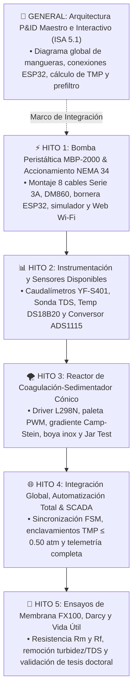

# 💧 PLANTA PILOTO DE ULTRAFILTRACIÓN INDUSTRIAL (FX100) & REACTOR DE COAGULACIÓN-SEDIMENTACIÓN
## Manual General del Proyecto, Arquitectura del Sistema y Guía de Navegación por Hitos

---

## 👥 Equipo de Trabajo & Contexto Académico

* **Codirector de Tesis**: **Ing. Enzo** *(Investigador Doctoral — Aplicación en Tesis Doctoral de Tratamiento de Aguas y Procesos de Separación por Membranas)*.
* **Tesistas de Grado (Ingeniería Industrial)**:
  * **Antonella Guitián**
  * **Owen Cañizares**
* **Objetivo Académico Conjunto**:
  Desarrollar, instrumentar y automatizar integralmente una planta piloto mecatrónica de tratamiento de agua que combine un **Reactor Floculador-Sedimentador Cónico** con un módulo de **Ultrafiltración Capilar de Fibra Hueca (Fresenius FX100)**, evaluando la cinética de ensuciamiento (*fouling*), modelando la Ley de Darcy y optimizando la vida útil de la membrana mediante control en tiempo real e IoT.

---

## 🗺️ Mapa de Navegación de los 5 Hitos de Trabajo (Consolidado)

Cada hito cuenta con su propia carpeta autocontenida con documentación técnica, esquemas de conexión, firmware compilado y probado, simuladores o plantillas de datos:



---

## 🧭 ¿Qué se busca y qué encontrarán en cada carpeta?

### 📁 [`00_General_y_P_ID_Planta/`](./00_General_y_P_ID_Planta/)
* **Objetivo General**: Mantener la visión global e integral de todo el banco de pruebas hidráulico y electrónico de la planta.
* **Qué encontrarán aquí**:
  * [`README.md`](./00_General_y_P_ID_Planta/README.md): Plano maestro P&ID según norma ISA 5.1 con diferenciación estricta de mangueras de proceso (línea llena) y señales de control al ESP32 (línea punteada), justificación de la válvula reguladora de aguja $V_{\text{reg}}$, especificación del prefiltro de succión y matriz de conexionado (directo vs indirecto).
  * [`diagrama_pid_interactivo.html`](./00_General_y_P_ID_Planta/diagrama_pid_interactivo.html): Diagrama interactivo ejecutable en navegador con selector de capas (mangueras/cables), flujo animado y simulador de Presión Transmembrana (TMP).
  * [`boceto_original_enzo_pid.jpg`](./00_General_y_P_ID_Planta/boceto_original_enzo_pid.jpg): Fotografía en alta resolución del boceto original de banco de Enzo.

---

### 📁 [`01_Hito1_Control_Accionamiento_NEMA34_DM860/`](./01_Hito1_Control_Accionamiento_NEMA34_DM860/)
* **Objetivo de los Alumnos**: Dejar la bomba peristáltica MBP-2000 funcionando a la perfección con el motor NEMA 34 ($4.5\text{ Nm}$, 8 cables) y el driver DM860, tanto por consola serie como por Wi-Fi desde el celular con el shield de borneras.
* **Qué aprenderán aquí**:
  * Por qué el bobinado en **Bipolar Serie (3.0A)** entrega los $4.5\text{ Nm}$ completos protegiendo el transformador de $24\text{ VAC}$ y evitando sobrecalentamientos.
  * Por qué el switch **SW4 en `OFF`** activa la reducción al 50% de corriente en reposo.
  * Cómo conectar a tornillo el ESP32 en su shield de borneras (D18 a PUL+, D19 a DIR+, GND común).
  * Control determinístico por hardware LEDC del ESP32 a 0% de uso de CPU.
* **Archivos Clave**:
  * [`03_Firmware_Control_Bomba/bomba/bomba.ino`](./01_Hito1_Control_Accionamiento_NEMA34_DM860/03_Firmware_Control_Bomba/bomba/bomba.ino): Firmware oficial con **Control Wi-Fi**, Dashboard Web táctil, cálculo de caudal en L/min, litros totales y ArduinoOTA.
  * [`03_Firmware_Control_Bomba/Guia_Montaje_Bomba_y_Bornera_ESP32.md`](./01_Hito1_Control_Accionamiento_NEMA34_DM860/03_Firmware_Control_Bomba/Guia_Montaje_Bomba_y_Bornera_ESP32.md): Manual ilustrado de conexionado de la bornera.
  * [`02_Montaje_y_Optimizacion_Motor/GUIA_OPTIMIZACION_MOTOR_NEMA34_Y_DIP_SWITCHES.md`](./01_Hito1_Control_Accionamiento_NEMA34_DM860/02_Montaje_y_Optimizacion_Motor/GUIA_OPTIMIZACION_MOTOR_NEMA34_Y_DIP_SWITCHES.md): Puesta a punto según hoja oficial de CNC Insumos S.R.L.
  * [`01_Hardware_y_Cableado/Guia_Conexionado_Fisico_DM860.md`](./01_Hito1_Control_Accionamiento_NEMA34_DM860/01_Hardware_y_Cableado/Guia_Conexionado_Fisico_DM860.md): Conexión de potencia y señales lógicas en cátodo común.
  * [`04_Simulador_Interactivo/simulador_bomba.html`](./01_Hito1_Control_Accionamiento_NEMA34_DM860/04_Simulador_Interactivo/simulador_bomba.html): Simulador visual interactivo de rampa, frecuencia y disipación de calor.
  * [`03_Firmware_Control_Bomba/Hito1_ControlMotor/Hito1_ControlMotor.ino`](./01_Hito1_Control_Accionamiento_NEMA34_DM860/03_Firmware_Control_Bomba/Hito1_ControlMotor/Hito1_ControlMotor.ino): Firmware modular de prueba serie (115200 baudios).

---

### 📁 [`02_Hito2_Instrumentacion_Sensores/`](./02_Hito2_Instrumentacion_Sensores/)
* **Objetivo de los Alumnos**: Conectar y calibrar los sensores físicos disponibles en el laboratorio para monitorear el proceso en tiempo real.
* **Qué aprenderán aquí**:
  * Lectura de pulsos de microflujo con los caudalímetros de efecto Hall YF-S401 ($98\text{ pulsos/seg} = 1\text{ L/min}$).
  * Protocolo OneWire digital para la sonda sumergible de temperatura DS18B20.
  * Medición de calidad de agua en partes por millón ($\text{ppm}$) con la sonda analógica de TDS.
  * Manejo del bus I2C y conversión analógica-digital de alta precisión con el chip **ADS1115 de 16 bits**.
* **Archivos Clave**:
  * [`README.md`](./02_Hito2_Instrumentacion_Sensores/README.md): Ecuaciones de calibración, tabla de sensores y teoría de señales.
  * [`01_Guias_Montaje_y_Calibracion/Guia_Montaje_Hidraulico_Sensores.md`](./02_Hito2_Instrumentacion_Sensores/01_Guias_Montaje_y_Calibracion/Guia_Montaje_Hidraulico_Sensores.md): Dónde y cómo intercalar cada sensor en la cañería.
  * [`01_Guias_Montaje_y_Calibracion/Guia_Calibracion_ADC_ADS1115_y_Sensores.md`](./02_Hito2_Instrumentacion_Sensores/01_Guias_Montaje_y_Calibracion/Guia_Calibracion_ADC_ADS1115_y_Sensores.md): Fórmulas de conversión analógica, ganancia y compensación térmica.
  * [`02_Firmware_Test_Sensores/firmware_sensores_test/firmware_sensores_test.ino`](./02_Hito2_Instrumentacion_Sensores/02_Firmware_Test_Sensores/firmware_sensores_test/firmware_sensores_test.ino): Firmware de prueba integral que imprime telemetría en formato CSV por puerto serie.

---

### 📁 [`03_Hito3_Reactor_Sedimentador_Agitador/`](./03_Hito3_Reactor_Sedimentador_Agitador/)
* **Objetivo de los Alumnos**: Automatizar el pretratamiento fisicoquímico en el reactor cónico antes de enviar el agua a la membrana.
* **Qué aprenderán aquí**:
  * Ecuación del Gradiente de Velocidad de Camp-Stein ($G = \sqrt{P / (\mu V)}$).
  * Mezcla Rápida ($150\text{ RPM}$, $G \approx 400\text{ s}^{-1}$) para dispersión del biocoagulante (*Opuntia ficus-indica*).
  * Mezcla Lenta ($30\text{ RPM}$, $G \approx 35\text{ s}^{-1}$) para crecimiento de flóculos sin rotura por cizallamiento.
  * Sedimentación estática ($0\text{ RPM}$) y decantación de lodos.
  * Control de velocidad PWM con el driver Puente H **L298N** y corte de seguridad por **boya de nivel de acero inoxidable**.
* **Archivos Clave**:
  * [`README.md`](./03_Hito3_Reactor_Sedimentador_Agitador/README.md): Fundamentos de ingeniería química, gradiente $G$ y esquema de conexiones.
  * [`01_Protocolos_y_Teoria_Floculacion/Protocolo_Ensayo_Coagulacion_Floculacion_JarTest.md`](./03_Hito3_Reactor_Sedimentador_Agitador/01_Protocolos_y_Teoria_Floculacion/Protocolo_Ensayo_Coagulacion_Floculacion_JarTest.md): Protocolo completo de preparación de solución madre de *Opuntia*, dosificación y cálculo de remoción $\eta$.
  * [`02_Firmware_Control_Agitador/Guia_Control_Agitador_L298N_y_Boya.md`](./03_Hito3_Reactor_Sedimentador_Agitador/02_Firmware_Control_Agitador/Guia_Control_Agitador_L298N_y_Boya.md): Guía de conexión pin a pin, modulación PWM y enclavamiento de nivel.
  * [`02_Firmware_Control_Agitador/firmware_sedimentador/firmware_sedimentador.ino`](./03_Hito3_Reactor_Sedimentador_Agitador/02_Firmware_Control_Agitador/firmware_sedimentador/firmware_sedimentador.ino): Firmware con Máquina de Estados Finitos (FSM) no bloqueante.
  * [`03_Compras_y_Ferreteria_Hidraulica/Guia_Compras_Hidraulicas_y_Locales_Salta.md`](./03_Hito3_Reactor_Sedimentador_Agitador/03_Compras_y_Ferreteria_Hidraulica/Guia_Compras_Hidraulicas_y_Locales_Salta.md): Guía de adaptación de 1/2" a 1/4" con bujes de bronce, lista para mostrador y locales en Salta Capital.

---

### 📁 [`04_Hito4_Integracion_Automatizacion_IoT/`](./04_Hito4_Integracion_Automatizacion_IoT/)
* **Objetivo de los Alumnos**: Poner en marcha la planta completa de manera sincronizada y autónoma.
* **Qué aprenderán aquí**:
  * Integración de los 3 transductores de presión hidráulica ($P_1, P_2, P_3$).
  * Cálculo dinámico de la Presión Transmembrana:
    $$\text{TMP} = \frac{P_1 + P_2}{2} - P_3$$
  * **Enclavamiento de Seguridad Mandatorio**: Si $\text{TMP} > 0.50\text{ atm}$, el ESP32 apaga la bomba de inmediato para proteger los capilares de Polisulfona.
  * Dashboard SCADA web unificado con control simultáneo de bomba, agitador, boya y telemetría.
* **Archivos Clave**:
  * [`README.md`](./04_Hito4_Integracion_Automatizacion_IoT/README.md): Arquitectura global del SCADA, enclavamientos y especificaciones de transductores.
  * [`01_Arquitectura_y_Enclavamientos/Guia_Enclavamientos_Seguridad_y_SCADA.md`](./04_Hito4_Integracion_Automatizacion_IoT/01_Arquitectura_y_Enclavamientos/Guia_Enclavamientos_Seguridad_y_SCADA.md): Explicación detallada de enclavamientos, cálculo de TMP y endpoints REST.
  * [`02_Firmware_SCADA_Master/firmware_planta_completa/firmware_planta_completa.ino`](./04_Hito4_Integracion_Automatizacion_IoT/02_Firmware_SCADA_Master/firmware_planta_completa/firmware_planta_completa.ino): Firmware maestro integral del sistema.

---

### 📁 [`05_Hito5_Ensayos_Membrana_VidaUtil/`](./05_Hito5_Ensayos_Membrana_VidaUtil/)
* **Objetivo de los Alumnos**: Obtención de los datos experimentales para la redacción final de la Tesis de Ingeniería Industrial y aportes a la Beca Doctoral.
* **Qué aprenderán aquí**:
  * Modelo matemático de la Ley de Darcy para ultrafiltración:
    $$J = \frac{Q_p}{A_m} = \frac{\text{TMP}}{\mu(T) \cdot (R_m + R_{\text{torta}} + R_{\text{irrev}})}$$
  * Determinación experimental de la resistencia de la membrana limpia ($R_m$).
  * Comparación de velocidad de ensuciamiento: Agua cruda turbia vs. Sobrenadante clarificado del Hito 3.
  * Eficiencia del ciclo de Retrolavado (*Backwash*) para extender la vida útil del módulo FX100.
  * Verificación de calidad de agua tratada según los estándares del Código Alimentario Argentino (CAA).
* **Archivos Clave**:
  * [`README.md`](./05_Hito5_Ensayos_Membrana_VidaUtil/README.md): Metodología experimental y diseño de ensayos de transporte.
  * [`01_Protocolo_Ensayos_Darcy_y_Fouling/Protocolo_Ensayos_Darcy_y_VidaUtil.md`](./05_Hito5_Ensayos_Membrana_VidaUtil/01_Protocolo_Ensayos_Darcy_y_Fouling/Protocolo_Ensayos_Darcy_y_VidaUtil.md): Protocolo completo de ensayos Darcy, factor de temperatura TCF y normas CAA.
  * [`02_Planillas_y_Datos_Tesis/Guia_Analisis_Datos_Graficos_Tesis.md`](./05_Hito5_Ensayos_Membrana_VidaUtil/02_Planillas_y_Datos_Tesis/Guia_Analisis_Datos_Graficos_Tesis.md): Guía de procesamiento de datos con script de Python para figuras de tesis a 300 DPI y guía de Excel.
  * [`02_Planillas_y_Datos_Tesis/plantilla_datos_ensayo_tesis.csv`](./05_Hito5_Ensayos_Membrana_VidaUtil/02_Planillas_y_Datos_Tesis/plantilla_datos_ensayo_tesis.csv): Matriz de datos experimental segundo a segundo.

---

## ⚡ Reglas de Oro en el Laboratorio (Seguridad y Confiabilidad)

1. **Separación Eléctrica Estricta**:
   * El **Transformador $24\text{ VAC}$** se conecta **únicamente** a los bornes `AC/AC` del driver Leadshine DM860.
   * La **Fuente de $12\text{V DC}$** alimenta el driver L298N y la entrada del reductor LM2596.
   * La salida del LM2596 debe calibrarse a **$5.00\text{V DC}$ exactos** con un tester antes de alimentar el ESP32.
2. **Distribución de Masa Única (GND Común)**:
   * El ESP32 solo debe tener **un cable** saliendo de su pin `GND` hacia la regleta de empalme rápido, y desde allí encadenar la masa a los demás componentes.
3. **Cuidado Extremo de la Membrana FX100**:
   * La membrana Fresenius FX100 posee fibras capilares de $0.01\,\mu\text{m}$.
   * **Bajo ninguna circunstancia se debe operar a presiones superiores a $0.50\text{ atm}$ ($50.66\text{ kPa}$)**.
   * Al finalizar cada jornada de ensayo, la membrana debe lavarse con agua destilada y conservarse con líquido en su interior para evitar la resecación de los poros.

---

## 🐙 Guía de Git y GitHub para Antonella y Owen

El repositorio del proyecto está alojado en:  
👉 **[https://github.com/enzoocorte/Planta-Ultrafiltracion](https://github.com/enzoocorte/Planta-Ultrafiltracion)**

### Flujo de Trabajo Diario:

1. **Antes de empezar a trabajar en el laboratorio**:
   Traer los últimos cambios subidos abriendo la terminal en la carpeta del proyecto:
   ```bash
   git pull origin main
   ```
2. **Al realizar modificaciones en el código o tomar datos**:
   Guardar y documentar los avances con un mensaje claro:
   ```bash
   git add .
   git commit -m "Hito X: Se calibró el sensor de caudal y se ensayó a 60 RPM"
   ```
3. **Al terminar la jornada de trabajo**:
   Subir todo a la nube para que el Codirector y el equipo puedan supervisar:
   ```bash
   git push origin main
   ```
