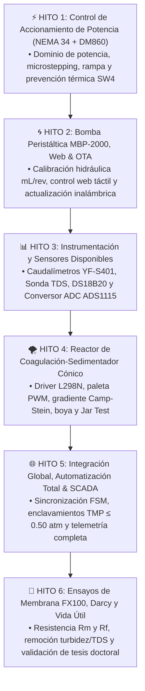

# 💧 PLANTA PILOTO DE ULTRAFILTRACIÓN INDUSTRIAL (FX100) & REACTOR DE COAGULACIÓN-SEDIMENTACIÓN
## Manual General del Proyecto, Arquitectura del Sistema y Guía de Navegación por Hitos

---

## 👥 Equipo de Trabajo & Contexto Académico

* **Codirector de Tesis**: **Ing. Enzo** *(Investigador Doctoral — Aplicación en Tesis Doctoral de Tratamiento de Aguas y Procesos de Separación por Membranas)*.
* **Tesistas de Grado (Ingeniería Industrial)**:
  * **Antonella Guitián**
  * **Owen Cañizares**
* **Objetivo Académico Conjunto**:
  Desarrollar, instrumentar y automatizar integralmente una planta piloto mecatrónica de tratamiento de agua que combine un **Reactor Floculador-Sedimentador Cónico** con un módulo de **Ultrafiltración Capilar de Fibra Hueca (Fresenius FX100)**, evaluando la cinética de ensuciamiento (*fouling*), modelando la Ley de Darcy y optimizando la vida útil de la membrana mediante control en tiempo real e IoT.

---

## 🗺️ Mapa de Navegación de los 6 Hitos de Trabajo

Cada hito cuenta con su propia carpeta autocontenida con documentación técnica, esquemas de conexión, firmware compilado y probado, simuladores o plantillas de datos:



---

## 🧭 ¿Qué se busca y qué encontrarán en cada carpeta?

### 📁 [`01_Hito1_Control_Accionamiento_NEMA34_DM860/`](./01_Hito1_Control_Accionamiento_NEMA34_DM860/)
* **Objetivo de los Alumnos**: Lograr el control estable del motor NEMA 34 ($4\text{ Nm}$, $6\text{ A}$) y el driver DM860 desde el ESP32, comprendiendo la física del accionamiento.
* **Qué aprenderán aquí**:
  * Por qué el transformador entrega $24\text{ VAC}$ y el driver rectifica internamente a un bus de $\approx 34\text{ VDC}$.
  * Cómo identificar las fases A y B del motor con tester o cortocircuito.
  * Por qué el switch **SW4 en `OFF`** es vital para reducir la corriente al 50% en reposo y evitar que el motor hierva.
  * Generación de pulsos por hardware LEDC del ESP32 a 0% de uso de CPU.
* **Archivos Clave**:
  * `README.md`: Documento formal del hito con las secciones 1.1 a 1.8.
  * `Guia_Conexionado_Fisico_DM860.md`: Manual paso a paso de cableado de taller.
  * `Hito1_ControlMotor/Hito1_ControlMotor.ino`: Firmware listo para probar por Monitor Serie (`R30`, `R60`, `DIR`, `STOP`).

---

### 📁 [`02_Hito2_Bomba_Peristaltica_NEMA34/`](./02_Hito2_Bomba_Peristaltica_NEMA34/)
* **Objetivo de los Alumnos**: Integrar el cabezal de la bomba peristáltica MBP-2000, establecer la curva característica de caudal vs. RPM y habilitar el control inalámbrico.
* **Qué aprenderán aquí**:
  * Relación de desplazamiento positivo volumétrico ($\approx 4.2\text{ mL/revolución}$).
  * Rampa de aceleración ($35\text{ RPM/s}$) para que los rodillos venzan la compresión elastomérica de la manguera sin trabarse.
  * Servidor Web embebido en el ESP32 y programación inalámbrica por Wi-Fi (*ArduinoOTA*).
* **Archivos Clave**:
  * `README.md`: Teoría mecatrónica de la bomba peristáltica.
  * `simulador_bomba.html`: Simulador interactivo en HTML5 para visualizar rampa y calor.
  * `firmware_bomba_nema34/firmware_bomba_nema34.ino`: Firmware con Dashboard web para celular y PC.

---

### 📁 [`03_Hito3_Instrumentacion_Sensores/`](./03_Hito3_Instrumentacion_Sensores/)
* **Objetivo de los Alumnos**: Conectar y calibrar los sensores físicos disponibles en el laboratorio para monitorear el proceso en tiempo real.
* **Qué aprenderán aquí**:
  * Lectura de pulsos de microflujo con los caudalímetros de efecto Hall YF-S401 ($98\text{ pulsos/seg} = 1\text{ L/min}$).
  * Protocolo OneWire digital para la sonda sumergible de temperatura DS18B20.
  * Medición de calidad de agua en partes por millón ($\text{ppm}$) con la sonda analógica de TDS.
  * Manejo del bus I2C y conversión analógica-digital de alta precisión con el chip **ADS1115 de 16 bits**.
* **Archivos Clave**:
  * `README.md`: Ecuaciones de calibración y teoría de señales.
  * `Guia_Montaje_Hidraulico_Sensores.md`: Dónde intercalar cada sensor en la cañería.
  * `firmware_sensores_test/firmware_sensores_test.ino`: Firmware de prueba integral que imprime telemetría en formato CSV por puerto serie.

---

### 📁 [`04_Hito4_Reactor_Sedimentador_Agitador/`](./04_Hito4_Reactor_Sedimentador_Agitador/)
* **Objetivo de los Alumnos**: Automatizar el pretratamiento fisicoquímico en el reactor cónico antes de enviar el agua a la membrana.
* **Qué aprenderán aquí**:
  * Ecuación del Gradiente de Velocidad de Camp-Stein ($G = \sqrt{P / (\mu V)}$).
  * Mezcla Rápida ($150\text{ RPM}$, $G \approx 400\text{ s}^{-1}$) para dispersión del biocoagulante (*Opuntia ficus-indica*).
  * Mezcla Lenta ($30\text{ RPM}$, $G \approx 35\text{ s}^{-1}$) para crecimiento de flóculos sin rotura por cizallamiento.
  * Sedimentación estática ($0\text{ RPM}$) y decantación de lodos.
  * Control de velocidad PWM con el driver Puente H **L298N** y corte de seguridad por **boya de nivel de acero inoxidable**.
* **Archivos Clave**:
  * `README.md`: Teoría de coagulación-floculación y protocolo del Jar Test.
  * `firmware_sedimentador/firmware_sedimentador.ino`: Firmware con Máquina de Estados Finitos (FSM).

---

### 📁 [`05_Hito5_Integracion_Automatizacion_IoT/`](./05_Hito5_Integracion_Automatizacion_IoT/)
* **Objetivo de los Alumnos**: Poner en marcha la planta completa de manera sincronizada y autónoma.
* **Qué aprenderán aquí**:
  * Integración de los 3 transductores de presión hidráulica ($P_1, P_2, P_3$).
  * Cálculo dinámico de la Presión Transmembrana:
    $$\text{TMP} = \frac{P_1 + P_2}{2} - P_3$$
  * **Enclavamiento de Seguridad Mandatorio**: Si $\text{TMP} > 0.50\text{ atm}$, el ESP32 apaga la bomba de inmediato para proteger los capilares de Polisulfona.
  * Dashboard SCADA web unificado con control simultáneo de bomba, agitador, boya y telemetría.
* **Archivos Clave**:
  * `README.md`: Arquitectura global y especificaciones de compras finales.
  * `firmware_planta_completa/firmware_planta_completa.ino`: Firmware maestro integral del sistema.

---

### 📁 [`06_Hito6_Ensayos_Membrana_VidaUtil/`](./06_Hito6_Ensayos_Membrana_VidaUtil/)
* **Objetivo de los Alumnos**: Obtención de los datos experimentales para la redacción final de la Tesis de Ingeniería Industrial y aportes a la Beca Doctoral.
* **Qué aprenderán aquí**:
  * Modelo matemático de la Ley de Darcy para ultrafiltración:
    $$J = \frac{Q_p}{A_m} = \frac{\text{TMP}}{\mu(T) \cdot (R_m + R_{\text{torta}} + R_{\text{poros}})}$$
  * Determinación experimental de la resistencia de la membrana limpia ($R_m$).
  * Comparación de velocidad de ensuciamiento: Agua cruda turbia vs. Sobrenadante clarificado del Hito 4.
  * Eficiencia del ciclo de Retrolavado (*Backwash*) para extender la vida útil del módulo FX100.
  * Verificación de calidad de agua tratada según los estándares del Código Alimentario Argentino (CAA).
* **Archivos Clave**:
  * `README.md`: Metodología experimental y diseño de ensayos.
  * `plantilla_datos_ensayo_tesis.csv`: Archivo preparado para registrar ensayos y graficar en Excel o Python.

---

## ⚡ Reglas de Oro en el Laboratorio (Seguridad y Confiabilidad)

1. **Separación Eléctrica Estricta**:
   * El **Transformador $24\text{ VAC}$** se conecta **únicamente** a los bornes `AC/AC` del driver Leadshine DM860.
   * La **Fuente de $12\text{V DC}$** alimenta el driver L298N y la entrada del reductor LM2596.
   * La salida del LM2596 debe calibrarse a **$5.00\text{V DC}$ exactos** con un tester antes de alimentar el ESP32.
2. **Distribución de Masa Única (GND Común)**:
   * El ESP32 solo debe tener **un cable** saliendo de su pin `GND` hacia la regleta de empalme rápido, y desde allí encadenar la masa a los demás componentes.
3. **Cuidado Extremo de la Membrana FX100**:
   * La membrana Fresenius FX100 posee fibras capilares de $0.01\,\mu\text{m}$.
   * **Bajo ninguna circunstancia se debe operar a presiones superiores a $0.50\text{ atm}$ ($50.66\text{ kPa}$)**.
   * Al finalizar cada jornada de ensayo, la membrana debe lavarse con agua destilada y conservarse con líquido en su interior para evitar la resecación de los poros.

---

## 🐙 Guía de Git y GitHub para Antonella y Owen

El repositorio del proyecto está alojado en:  
👉 **[https://github.com/enzoocorte/Planta-Ultrafiltracion](https://github.com/enzoocorte/Planta-Ultrafiltracion)**

### Flujo de Trabajo Diario:

1. **Antes de empezar a trabajar en el laboratorio**:
   Traer los últimos cambios subidos abriendo la terminal en la carpeta del proyecto:
   ```bash
   git pull origin main
   ```
2. **Al realizar modificaciones en el código o tomar datos**:
   Guardar y documentar los avances con un mensaje claro:
   ```bash
   git add .
   git commit -m "Hito X: Se calibró el sensor de caudal y se ensayó a 60 RPM"
   ```
3. **Al terminar la jornada de trabajo**:
   Subir todo a la nube para que el Codirector y el equipo puedan supervisar:
   ```bash
   git push origin main
   ```
